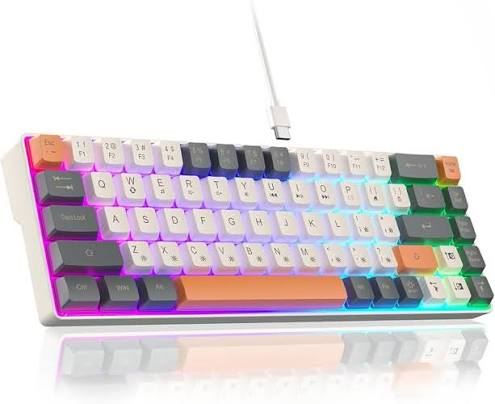

# ✦ Методическое пособие: Клиентская часть (Frontend)
# Интернет-магазин «TechParts» — подробное руководство

---

## Как пользоваться этим пособием

Это пособие посвящено **только клиентской части** (frontend) проекта TechParts.
В приложении в конце пособия показано, как подставить заглушки для работы без сервера.

Каждая глава построена по единой структуре:
- **✦ Задание** — что мы создадим к концу главы
- **⌬ Теория** — простые объяснения с аналогиями из жизни
- **⧉ Примеры** — маленькие изолированные фрагменты кода с разбором
- **⚙ Реализация** — пошаговое написание кода с комментариями к каждой строке

---

# Глава 1. Главная страница: HTML-разметка (`index.html`)

## ✦ Задание

Создать HTML-разметку главной страницы: шапка с логотипом и навигацией, слайдер с 4 изображениями, секция «Популярные товары» с 3 карточками, подвал. *(Критерии №4, №5, №7, №10, №11, №12, №15)*

## ⌬ Теория

### Структура HTML-документа

Каждый HTML-документ — это текстовый файл с командами в угловых скобках (тегами).
Браузер читает теги и рисует страницу.

```
<!DOCTYPE html>          ← «Я — HTML5 документ»
<html lang="ru">         ← Начало документа, язык — русский
  <head>                 ← «Голова»: невидимые настройки
    <meta charset="UTF-8">    ← Кодировка (русские буквы)
    <title>Заголовок</title>   ← Текст на вкладке браузера
    <link rel="stylesheet" href="css/style.css">  ← Стили
  </head>
  <body>                 ← «Тело»: всё, что видит пользователь
    ...
  </body>
</html>
```

### Семантические теги

**Семантические** — значит «со смыслом». Браузер и поисковые системы по ним
понимают, где шапка, где основной контент, а где подвал.

| Тег | Значение | Где используется |
|-----|----------|-----------------|
| `<header>` | Шапка страницы | Вверху: логотип + меню |
| `<nav>` | Навигационное меню | Внутри шапки |
| `<main>` | Основной контент | Между шапкой и подвалом |
| `<section>` | Логический раздел | Слайдер, «Популярные товары» |
| `<footer>` | Подвал страницы | Внизу: контакты, копирайт |

> **Аналогия:** Без семантических тегов HTML — это стена текста. С ними — книга
> с заголовками, главами и оглавлением.

### Тег `` и атрибут `alt`

```html

```
- `src` — путь к картинке
- `alt` — текст, если картинка не загрузилась (или для слабовидящих)

### SVG-логотип

SVG — **векторный** формат. В отличие от JPG/PNG он не теряет качество при
увеличении, потому что хранится не как пиксели, а как математические формулы.

## ⧉ Примеры

### Минимальная страница

```html
<!DOCTYPE html>
<html lang="ru">
<head>
  <meta charset="UTF-8">
  <title>Моя страница</title>
</head>
<body>
  <h1>Привет, мир!</h1>
  <p>Это параграф текста.</p>
</body>
</html>
```

### Семантика vs «div-суп»

```html
<!-- ✖ Плохо: непонятно, что где -->
<div class="top"><div class="links">...</div></div>
<div class="middle">...</div>
<div class="bottom">...</div>

<!-- ✔ Хорошо: сразу видно структуру -->
<header><nav>...</nav></header>
<main>...</main>
<footer>...</footer>
```

### Карточка товара

```html
<div class="card">
  
  <div class="card-body">
    <div class="card-title">Intel Core i7</div>
    <div class="card-desc">20 ядер, 5.6 ГГц</div>
    <div class="card-price">38 990 ₽</div>
  </div>
</div>
```

## ⚙ Реализация

### Шаг 1: Базовая структура файла

Откройте `frontend/index.html` и введите:

```html
<!DOCTYPE html>
<html lang="ru">
<head>
  <meta charset="UTF-8">
  <meta name="viewport" content="width=device-width, initial-scale=1.0">
  <title>TechParts — Собери ПК своей мечты</title>
  <!-- Критерий №6: Подключение единого файла стилей -->
  <link rel="stylesheet" href="css/style.css">
</head>
<body>

  <!-- Содержимое добавим ниже шаг за шагом -->

  <!-- Скрипты подключаем ПЕРЕД </body>, чтобы HTML успел загрузиться -->
  <script src="js/mock-data.js"></script>  <!-- Заглушки (убрать позже) -->
  <script src="js/navigation.js"></script> <!-- Динамическое меню -->
  <script src="js/slider.js"></script>     <!-- Слайдер -->
</body>
</html>
```

**Почему скрипты перед `</body>`, а не в `<head>`?**

Когда браузер встречает `<script>`, он останавливает обработку HTML и выполняет
скрипт. Если скрипт в `<head>`, элементы страницы ещё не созданы — и JavaScript
не найдёт их (`document.getElementById` вернёт `null`).

### Шаг 2: Шапка (header)

Вставьте внутрь `<body>`, перед скриптами:

```html
  <!-- ============================================================
       ШАПКА (HEADER) — Критерий №11 (до 3 баллов)
       1 балл — тег header
       1 балл — шапка на главной
       1 балл — шапка на всех страницах
       Семантический тег header — Критерий №7
       ============================================================ -->
  <header>
    <!-- Навигация — Критерий №13: тег nav (1 балл) -->
    <nav>
      <!-- Логотип — Критерий №10 (до 3 баллов) -->
      <!-- 1 балл — соответствие теме -->
      <!-- 1 балл — векторное изображение SVG -->
      <!-- 1 балл — надпись с названием сайта -->
      <a href="index.html" class="logo">
        
        TechParts
      </a>

      <!-- Контейнер для навигационного меню -->
      <!-- Критерий №13: меню для авторизованных и неавторизованных -->
      <!-- Заполняется динамически через navigation.js -->
      <div class="nav-links" id="nav-menu">
        <!-- JS подставит нужные ссылки -->
      </div>
    </nav>
  </header>
```

**Разбор каждого элемента:**

| Элемент | Что делает | Критерий |
|---------|-----------|----------|
| `<header>` | Семантический тег шапки | №7, №11 |
| `<nav>` | Семантический тег навигации | №7, №13 |
| `<a class="logo">` | Ссылка-логотип (при клике → главная) | №10 |
| `` | SVG-изображение логотипа | №10 |
| `<div id="nav-menu">` | Пустой контейнер — JS заполнит его ссылками | №13 |

### Шаг 3: Слайдер

```html
  <!-- Критерий №7: семантический тег main -->
  <main>

    <!-- ============================================================
         СЛАЙДЕР — Критерий №14 (до 3 баллов)
         1 балл — разметка и стилизация
         1 балл — автопереключение каждые 3 сек.
         1 балл — индикаторы и кнопки Вперёд/Назад
         ============================================================ -->
    <section>
      <div class="slider-container">

        <!-- 4 слайда. Первый имеет класс active — он виден при загрузке -->
        <!-- Критерий №5: использование изображений из задания -->
        <!-- Критерий №6: object-fit: cover — растянуть без искажения -->
        <div class="slider-slide active">
          
        </div>
        <div class="slider-slide">
          
        </div>
        <div class="slider-slide">
          
        </div>
        <div class="slider-slide">
          
        </div>

        <!-- Кнопки-стрелки «Назад» и «Вперёд» -->
        <!-- &#10094; = символ ◄,  &#10095; = символ ► -->
        <button class="slider-btn prev" id="slider-prev">&#10094;</button>
        <button class="slider-btn next" id="slider-next">&#10095;</button>

        <!-- Индикаторы (точки) — показывают текущий слайд -->
        <!-- data-index — пользовательский атрибут с номером слайда -->
        <div class="slider-dots" id="slider-dots">
          <button class="slider-dot active" data-index="0"></button>
          <button class="slider-dot" data-index="1"></button>
          <button class="slider-dot" data-index="2"></button>
          <button class="slider-dot" data-index="3"></button>
        </div>
      </div>
    </section>
```

**Как это устроено?**

```
┌─────────────────────────────────────┐
│  ◄  [  Изображение 800×400  ]  ►   │
│                                     │
│            ● ○ ○ ○                  │  ← точки-индикаторы
└─────────────────────────────────────┘

Все 4 слайда лежат ДРУГ НА ДРУГЕ (position: absolute).
Видим только тот, у которого класс "active" (opacity: 1).
Остальные невидимы (opacity: 0).

JavaScript каждые 3 секунды:
  1. Убирает active у текущего слайда
  2. Добавляет active следующему
  → Получается плавная смена (transition: opacity 0.5s)
```

### Шаг 4: Секция «Популярные товары»

```html
    <!-- ============================================================
         СЕКЦИЯ «ПОПУЛЯРНЫЕ ТОВАРЫ» — Критерий №15 (2 балла)
         Семантический тег section — Критерий №7
         ============================================================ -->
    <section>
      <h2 class="section-title">Популярные товары</h2>

      <!-- 3 карточки, расположенные в CSS Grid (3 колонки) -->
      <!-- Критерий №5: использование изображений из задания -->
      <div class="cards-grid">

        <!-- Карточка 1 -->
        <div class="card">
          <!-- Изображение 300×200, object-fit: cover — Критерий №6 -->
          
          <div class="card-body">
            <div class="card-title">Intel Core i7-14700K</div>
            <div class="card-desc">20 ядер, 5.6 ГГц. Идеален для игр и работы.</div>
            <div class="card-price">38 990 ₽</div>
          </div>
        </div>

        <!-- Карточка 2 -->
        <div class="card">
          
          <div class="card-body">
            <div class="card-title">NVIDIA GeForce RTX 4070 Ti</div>
            <div class="card-desc">12 ГБ GDDR6X, ray tracing, DLSS 3.</div>
            <div class="card-price">72 990 ₽</div>
          </div>
        </div>

        <!-- Карточка 3 -->
        <div class="card">
          
          <div class="card-body">
            <div class="card-title">ASUS ROG STRIX B650E-F</div>
            <div class="card-desc">AM5, DDR5, PCIe 5.0, WiFi 6E.</div>
            <div class="card-price">24 990 ₽</div>
          </div>
        </div>
      </div>

      <!-- Кнопка-ссылка на страницу каталога -->
      <a href="catalog.html" class="btn btn-primary btn-center">Весь каталог</a>
    </section>

  </main>
```

### Шаг 5: Подвал (footer)

```html
  <!-- ============================================================
       ПОДВАЛ (FOOTER) — Критерий №12 (до 3 баллов)
       1 балл — тег footer
       1 балл — подвал на главной
       1 балл — подвал на всех страницах
       ============================================================ -->
  <footer>
    <div class="footer-content">
      <!-- Колонка 1: О магазине -->
      <div class="footer-col">
        <h4>TechParts</h4>
        <p>Собери ПК своей мечты</p>
        <p>Надёжный поставщик комплектующих</p>
      </div>

      <!-- Колонка 2: Каталог -->
      <div class="footer-col">
        <h4>Каталог</h4>
        <a href="catalog.html">Процессоры</a>
        <a href="catalog.html">Видеокарты</a>
        <a href="catalog.html">Материнские платы</a>
      </div>

      <!-- Колонка 3: Контактная информация -->
      <div class="footer-col">
        <h4>Контакты</h4>
        <p>Email: info@techparts.ru</p>
        <p>Тел: +7 (800) 555-35-35</p>
        <p>Москва, ул. Технологическая, 42</p>
      </div>
    </div>

    <!-- Нижняя строка с копирайтом -->
    <div class="footer-bottom">
      &copy; 2024 TechParts. Все права защищены.
    </div>
  </footer>
```

### Шаг 6: Итоговая структура index.html

```
index.html
├── <!DOCTYPE html>
├── <html lang="ru">
│   ├── <head>
│   │   ├── <meta charset="UTF-8">
│   │   ├── <title>TechParts — Собери ПК своей мечты</title>
│   │   └── <link rel="stylesheet" href="css/style.css">
│   └── <body>
│       ├── <header>           ← Шапка (Критерий №11)
│       │   └── <nav>          ← Навигация (Критерий №13)
│       │       ├── <a class="logo">  ← Логотип (Критерий №10)
│       │       └── <div id="nav-menu">  ← Меню (JS)
│       ├── <main>             ← Основной контент (Критерий №7)
│       │   ├── <section>      ← Слайдер (Критерий №14)
│       │   └── <section>      ← Популярные товары (Критерий №15)
│       ├── <footer>           ← Подвал (Критерий №12)
│       ├── <script src="js/mock-data.js">   ← Заглушки
│       ├── <script src="js/navigation.js">  ← Меню
│       └── <script src="js/slider.js">      ← Слайдер
```

> **✖ Частые ошибки:**
> - Забыли `<!DOCTYPE html>` → браузер может отрисовать страницу неправильно
> - Логотип без тега `<a>` → по ТЗ логотип должен вести на главную
> - Файл `logo.svg` не в папке `images/` → картинка не загрузится
> - Скрипты в `<head>` вместо перед `</body>` → «Cannot read property of null»

---

# Глава 2. Стилизация: CSS (`css/style.css`)

## ✦ Задание

Создать единый файл стилей: задать цветовую гамму (3–5 цветов), шрифты,
оформить шапку, слайдер, карточки товаров, формы и подвал.
*(Критерии №6 — до 6 баллов, №9 — 2 балла)*

## ⌬ Теория

### Как подключается CSS

CSS подключается в `<head>` через тег `<link>`:
```html
<link rel="stylesheet" href="css/style.css">
```
Один файл стилей используется на **всех** страницах проекта.

### CSS-правило

```css
селектор {
  свойство: значение;
}
```

Пример:
```css
.card-title {        /* Селектор: все элементы с классом card-title */
  font-size: 17px;   /* Свойство: размер шрифта */
  font-weight: bold; /* Свойство: жирный текст */
  color: #1e293b;    /* Свойство: цвет текста */
}
```

### CSS-переменные (`:root`)

CSS-переменные позволяют задать цвет **один раз** и использовать его везде.
Если позже решите поменять цвет — меняете в одном месте.

```css
:root {
  --primary: #2563eb;           /* Задаём переменную */
}
.button {
  background: var(--primary);   /* Используем */
}
.link {
  color: var(--primary);        /* И здесь тоже */
}
```

### Flexbox — элементы в ряд

> **Аналогия:** Flexbox — это верёвка для белья. Вы вешаете элементы
> на верёвку, и они выстраиваются в ряд.

```css
.container {
  display: flex;                    /* Включаем flexbox */
  justify-content: space-between;   /* Раздвигаем к краям */
  align-items: center;              /* Выравниваем по вертикали */
  gap: 20px;                        /* Отступ между элементами */
}
```

### CSS Grid — сетка

> **Аналогия:** Grid — это полка для книг. Книги раскладываются в сетку:
> по 3 штуки в ряд.

```css
.cards-grid {
  display: grid;
  grid-template-columns: repeat(3, 1fr);  /* 3 равные колонки */
  gap: 25px;                               /* Отступ между ячейками */
}
```

### `object-fit: cover` — картинка без искажения

Если картинка не совпадает по пропорциям с контейнером, она может
растянуться или сплющиться. `object-fit: cover` обрезает лишнее, сохраняя
пропорции.

```css
.card-image {
  width: 100%;
  height: 200px;
  object-fit: cover;         /* Заполнить без искажения */
  object-position: center;   /* Центрировать обрезку */
}
```

### `position: sticky` — «прилипающая» шапка

```css
header {
  position: sticky;  /* Шапка «прилипает» к верху при прокрутке */
  top: 0;            /* Прилипает к самому верху */
  z-index: 100;      /* Шапка поверх остального контента */
}
```

### `transition` — плавные переходы

```css
.card {
  transition: transform 0.2s;   /* Плавность при изменении transform */
}
.card:hover {
  transform: translateY(-4px);  /* При наведении — приподнимается на 4px */
}
```

## ⧉ Примеры

### Сброс стилей

Браузеры добавляют свои отступы по умолчанию. Обнуляем их:
```css
* {
  margin: 0;
  padding: 0;
  box-sizing: border-box;  /* Ширина включает padding и border */
}
```

### Flexbox: логотип слева, меню справа

```css
nav {
  display: flex;
  justify-content: space-between;
  align-items: center;
}
```
Результат:
```
┌─────────────────────────────────────┐
│ [ЛОГО TechParts]    [Главная] [Каталог] [Войти] │
└─────────────────────────────────────┘
```

### Grid: 3 карточки в ряд

```css
.cards-grid {
  display: grid;
  grid-template-columns: repeat(3, 1fr);
  gap: 25px;
}
```
Результат:
```
┌──────────┐  ┌──────────┐  ┌──────────┐
│ Карточка │  │ Карточка │  │ Карточка │
│    1     │  │    2     │  │    3     │
└──────────┘  └──────────┘  └──────────┘
```

## ⚙ Реализация

### Шаг 1: Сброс стилей + CSS-переменные (цвета и тени)

```css
/* ============================================================
   TechParts — Единый файл стилей (style.css)
   Критерий №6: Стилизация сайта (до 6 баллов)
   ============================================================ */

/* --- Сброс стилей --- */
* {
  margin: 0;
  padding: 0;
  box-sizing: border-box;
}

/* --- Цветовая гамма: 5 основных цветов (Критерий №6: 2 балла) ---
   1) #2563eb — основной синий (кнопки, акценты)
   2) #1e293b — тёмный (шапка, подвал, текст)
   3) #f8fafc — светлый фон
   4) #06b6d4 — бирюзовый (дополнительный акцент)
   5) #ffffff — белый (карточки, формы)
*/
:root {
  --primary: #2563eb;
  --primary-dark: #1e40af;
  --dark: #1e293b;
  --light: #f8fafc;
  --accent: #06b6d4;
  --white: #ffffff;
  --text: #0f172a;
  --text-light: #64748b;
  --danger: #ef4444;
  --success: #22c55e;
  --border: #e2e8f0;
  --shadow: 0 2px 8px rgba(0, 0, 0, 0.1);
}

/* --- Базовый шрифт (Критерий №6: 2 балла — читабельные, не более 3) --- */
body {
  font-family: Arial, Helvetica, sans-serif;
  background: var(--light);
  color: var(--text);
  line-height: 1.6;
  min-width: 1200px;  /* Критерий №9: корректное отображение от 1200px */
}

/* --- Ссылки --- */
a { color: var(--primary); text-decoration: none; }
a:hover { text-decoration: underline; }
```

### Шаг 2: Шапка (header, nav, logo)

```css
/* --- ШАПКА — Критерий №11 --- */
header {
  background: var(--dark);
  color: var(--white);
  position: sticky;
  top: 0;
  z-index: 100;
  box-shadow: var(--shadow);
}

nav {
  max-width: 1200px;
  margin: 0 auto;
  padding: 15px 20px;
  display: flex;
  justify-content: space-between;
  align-items: center;
}

/* --- Логотип (Критерий №10) --- */
.logo {
  display: flex;
  align-items: center;
  gap: 10px;
  color: var(--white);
  font-size: 22px;
  font-weight: bold;
}
.logo img { height: 40px; }
.logo:hover { text-decoration: none; }

/* --- Ссылки навигации --- */
.nav-links { display: flex; align-items: center; gap: 25px; }
.nav-links a {
  color: var(--white);
  font-size: 15px;
  opacity: 0.85;
  transition: opacity 0.2s;
}
.nav-links a:hover { opacity: 1; text-decoration: none; }

/* --- Кнопки в навигации (Войти / Выйти) --- */
.nav-btn {
  background: var(--primary);
  color: var(--white);
  border: none;
  padding: 8px 20px;
  border-radius: 6px;
  cursor: pointer;
  font-size: 14px;
  transition: background 0.2s;
}
.nav-btn:hover { background: var(--primary-dark); }
.nav-btn.logout {
  background: transparent;
  border: 1px solid rgba(255, 255, 255, 0.3);
}
.nav-btn.logout:hover { border-color: var(--white); }
```

### Шаг 3: Слайдер

```css
/* --- СЛАЙДЕР — Критерий №14 --- */
.slider-container {
  position: relative;
  max-width: 800px;
  height: 400px;
  margin: 0 auto 40px;
  overflow: hidden;
  border-radius: 12px;
  box-shadow: var(--shadow);
}

/* Каждый слайд — абсолютно позиционирован (все друг на друге) */
.slider-slide {
  position: absolute;
  top: 0; left: 0;
  width: 100%; height: 100%;
  opacity: 0;                      /* Невидим по умолчанию */
  transition: opacity 0.5s ease;   /* Плавное появление */
}
.slider-slide.active { opacity: 1; }  /* Только active — виден */

/* Изображение растягивается без искажения (Критерий №6) */
.slider-slide img {
  width: 100%; height: 100%;
  object-fit: cover;
  object-position: center;
}

/* Кнопки-стрелки */
.slider-btn {
  position: absolute;
  top: 50%;
  transform: translateY(-50%);
  background: rgba(0, 0, 0, 0.5);
  color: var(--white);
  border: none;
  padding: 12px 16px;
  font-size: 20px;
  cursor: pointer;
  border-radius: 6px;
  z-index: 10;
  transition: background 0.2s;
}
.slider-btn:hover { background: rgba(0, 0, 0, 0.8); }
.slider-btn.prev { left: 15px; }
.slider-btn.next { right: 15px; }

/* Точки-индикаторы */
.slider-dots {
  position: absolute;
  bottom: 15px;
  left: 50%;
  transform: translateX(-50%);
  display: flex;
  gap: 10px;
  z-index: 10;
}
.slider-dot {
  width: 12px; height: 12px;
  border-radius: 50%;
  background: rgba(255, 255, 255, 0.5);
  cursor: pointer;
  border: none;
  transition: background 0.2s;
}
.slider-dot.active { background: var(--white); }
```

### Шаги 4–8: Карточки, кнопки, формы, фильтры, подвал, модальное окно

Полный файл `style.css` содержит стили для всех компонентов проекта.
Принцип везде одинаковый:
1. Используем CSS-переменные для цветов
2. Flexbox/Grid для расположения
3. `border-radius` для скруглений
4. `transition` для плавных эффектов
5. `box-shadow` для «объёмности»

> **✖ Частые ошибки:**
> - Путь в `<link href="style.css">` неправильный → стили не подключаются.
>   Правильно: `href="css/style.css"` (файл лежит в папке `css/`)
> - Забыли `box-sizing: border-box` → padding увеличивает ширину элемента,
>   и вёрстка «ломается»
> - Забыли `min-width: 1200px` на `body` → горизонтальная прокрутка при
>   маленьком окне (Критерий №9)

---

# Глава 3. JavaScript: слайдер (`js/slider.js`)

## ✦ Задание

Написать слайдер на чистом JavaScript (без библиотек): автоматическое
переключение каждые 3 секунды, кнопки «Вперёд»/«Назад», клик по точкам.
*(Критерий №14 — до 3 баллов)*

## ⌬ Теория

### DOM (Document Object Model)

> **Аналогия:** DOM — это **пульт управления** страницей. Через DOM мы
> можем найти любой элемент, изменить его текст, добавить/убрать класс,
> скрыть или показать.

### Основные команды DOM

| Команда | Что делает |
|---------|-----------|
| `document.getElementById('id')` | Найти элемент по id |
| `document.querySelectorAll('.класс')` | Найти все элементы по классу |
| `element.classList.add('active')` | Добавить CSS-класс |
| `element.classList.remove('active')` | Убрать CSS-класс |
| `element.addEventListener('click', fn)` | Реагировать на событие |
| `element.getAttribute('data-index')` | Получить значение атрибута |

### `setInterval` — повторять действие

```javascript
setInterval(() => {
  console.log('Тик!');   // Выполнится каждые 3 секунды
}, 3000);
```

### Оператор `%` (остаток от деления) — зацикливание

```javascript
// Если index выходит за границы массива — возвращаемся в начало
currentSlide = (index + slides.length) % slides.length;

// Пример: slides.length = 4 (индексы 0, 1, 2, 3)
// (3 + 1) % 4 = 0  → после последнего идём на первый
// (0 - 1 + 4) % 4 = 3  → перед первым идём на последний
```

## ⧉ Примеры

### Минимальный переключатель (2 строки)

```html
<p id="text">Текст 1</p>
<button onclick="document.getElementById('text').textContent = 'Текст 2'">
  Поменять
</button>
```

### Добавление/удаление класса

```javascript
// Делаем элемент видимым
element.classList.add('active');    // CSS: .active { opacity: 1; }

// Делаем элемент невидимым
element.classList.remove('active'); // Возвращается opacity: 0
```

## ⚙ Реализация

### Полный код `js/slider.js` (построчный разбор)

```javascript
// ============================================================
// TechParts — Слайдер на главной странице (slider.js)
// Критерий №14: Блок со слайдером (до 3 баллов)
// Реализация на чистом JavaScript без сторонних библиотек
// ============================================================

// --- Шаг 1: Получаем элементы слайдера из DOM ---
// querySelectorAll возвращает массив ВСЕХ элементов с данным классом
const slides = document.querySelectorAll('.slider-slide');  // [slide0, slide1, slide2, slide3]
const dots = document.querySelectorAll('.slider-dot');      // [dot0, dot1, dot2, dot3]
// getElementById находит ОДИН элемент по его id
const prevBtn = document.getElementById('slider-prev');     // Кнопка ◄
const nextBtn = document.getElementById('slider-next');     // Кнопка ►

// --- Шаг 2: Переменная для хранения текущего индекса ---
let currentSlide = 0;   // Начинаем с первого слайда (индекс 0)

// --- Шаг 3: Функция показа слайда по индексу ---
function showSlide(index) {
  // 3а. Убираем класс active у ВСЕХ слайдов и точек
  //     forEach перебирает каждый элемент массива
  slides.forEach(slide => slide.classList.remove('active'));
  dots.forEach(dot => dot.classList.remove('active'));

  // 3б. Вычисляем новый индекс с зацикливанием
  //     Если index = 4, а слайдов 4 → (4 + 4) % 4 = 0 → первый слайд
  //     Если index = -1 → (-1 + 4) % 4 = 3 → последний слайд
  currentSlide = (index + slides.length) % slides.length;

  // 3в. Добавляем active текущему слайду и точке
  slides[currentSlide].classList.add('active');   // Слайд станет видимым
  dots[currentSlide].classList.add('active');     // Точка станет белой
}

// --- Шаг 4: Обработчики событий ---

// Кнопка «Вперёд» → следующий слайд
nextBtn.addEventListener('click', () => {
  showSlide(currentSlide + 1);
});

// Кнопка «Назад» → предыдущий слайд
prevBtn.addEventListener('click', () => {
  showSlide(currentSlide - 1);
});

// Клик по точке → перейти к конкретному слайду
dots.forEach(dot => {
  dot.addEventListener('click', () => {
    // Читаем номер слайда из атрибута data-index
    const index = parseInt(dot.getAttribute('data-index'));
    showSlide(index);
  });
});

// --- Шаг 5: Автоматическое переключение каждые 3 секунды ---
// Критерий №14: 1 балл — автопереключение
setInterval(() => {
  showSlide(currentSlide + 1);   // Каждые 3000 мс → следующий слайд
}, 3000);
```

> **✖ Частые ошибки:**
> - «slides is not defined» → файл `slider.js` подключён, но на странице нет
>   элементов с классом `.slider-slide` (например, вы на `login.html`, а не `index.html`)
> - Слайдер не работает → проверьте, что у первого слайда есть класс `active`

---

# Глава 4. Динамическое меню (`js/navigation.js`)

## ✦ Задание

Создать скрипт, который при загрузке страницы проверяет, авторизован ли
пользователь, и показывает соответствующее меню.
*(Критерий №13 — до 4 баллов)*

## ⌬ Теория

### Два состояния меню

| Не авторизован | Авторизован |
|---------------|-------------|
| Главная | Главная |
| Каталог | Каталог |
| [Войти] | Мои заказы |
| | [Выйти] |

### `innerHTML` — вставка HTML-кода

```javascript
const div = document.getElementById('menu');
div.innerHTML = '<a href="index.html">Главная</a>';
// Теперь внутри div появилась ссылка
```

### `fetch` + заглушка

Без сервера мы используем `MOCK_AUTHORIZED` из `mock-data.js`.
С сервером — `fetch('/api/auth/check')`.

## ⚙ Реализация

### Полный код `js/navigation.js`

```javascript
// ============================================================
// TechParts — Динамическое навигационное меню (navigation.js)
// Критерий №13: Навигационное меню (до 4 баллов)
// ============================================================

const API_URL = 'http://localhost:3000/api';

// --- Обновление навигации при загрузке ---
async function updateNavigation() {
  let authorized = false;

  // --- Проверка статуса авторизации ---
  if (typeof USE_MOCK !== 'undefined' && USE_MOCK) {
    // РЕЖИМ ЗАГЛУШЕК: берём из mock-data.js
    authorized = MOCK_AUTHORIZED;
  } else {
    // РЕЖИМ СЕРВЕРА: fetch к API
    try {
      const response = await fetch(API_URL + '/auth/check', {
        credentials: 'include'   // Отправляем cookies (сессию)
      });
      const data = await response.json();
      authorized = data.authorized;
    } catch (err) {
      console.error('Ошибка проверки авторизации:', err);
    }
  }

  // --- Формируем меню в зависимости от статуса ---
  const navMenu = document.getElementById('nav-menu');

  if (authorized) {
    // Меню для АВТОРИЗОВАННЫХ: Главная, Каталог, Мои заказы, Выйти
    navMenu.innerHTML = `
      <a href="index.html">Главная</a>
      <a href="catalog.html">Каталог</a>
      <a href="my-orders.html">Мои заказы</a>
      <button class="nav-btn logout" onclick="logout()">Выйти</button>
    `;
  } else {
    // Меню для НЕАВТОРИЗОВАННЫХ: Главная, Каталог, Войти
    navMenu.innerHTML = `
      <a href="index.html">Главная</a>
      <a href="catalog.html">Каталог</a>
      <a href="login.html" class="nav-btn">Войти</a>
    `;
  }
}

// --- Выход из системы ---
async function logout() {
  if (typeof USE_MOCK !== 'undefined' && USE_MOCK) {
    // РЕЖИМ ЗАГЛУШЕК: просто перенаправляем
    alert('Выход выполнен (заглушка)');
    window.location.href = 'index.html';
  } else {
    // РЕЖИМ СЕРВЕРА: запрос на сервер
    await fetch(API_URL + '/auth/logout', {
      method: 'POST',
      credentials: 'include'
    });
    window.location.href = 'index.html';
  }
}

// Вызываем при загрузке страницы
updateNavigation();
```

**Как проверить два состояния меню (без сервера):**
1. Откройте `mock-data.js`
2. Поменяйте `MOCK_AUTHORIZED = false` на `MOCK_AUTHORIZED = true`
3. Обновите страницу → меню изменится

---

# Глава 5. Регистрация (`register.html` + `js/auth.js`)

## ✦ Задание

Создать форму регистрации с 6 полями и клиентской валидацией каждого поля.
Добавить маску телефона. *(Критерии №8, №16 — до 10 баллов)*

## ⌬ Теория

### HTML-формы

Форма — это контейнер `<form>`, внутри которого находятся поля ввода `<input>`.

```html
<form id="my-form">
  <label for="name">Имя:</label>
  <input type="text" id="name" required placeholder="Введите имя">
  <button type="submit">Отправить</button>
</form>
```

### Типы `<input>`

| type | Что отображает | Пример |
|------|---------------|--------|
| `text` | Обычное текстовое поле | Логин, ФИО |
| `password` | Скрывает символы точками | Пароль |
| `email` | Подсказывает формат email | user@mail.ru |
| `tel` | Подсказывает формат телефона | +7 999 123-45-67 |
| `number` | Только числа | Количество |
| `date` | Календарь для выбора даты | Дата доставки |

### Атрибуты валидации

| Атрибут | Что делает |
|---------|-----------|
| `required` | Поле обязательно — форма не отправится |
| `minlength="8"` | Минимальная длина текста |
| `min="1" max="10"` | Диапазон для чисел |
| `pattern="[A-Za-z0-9]+"` | Регулярное выражение |
| `placeholder="..."` | Подсказка серым текстом |

### `event.preventDefault()`

По умолчанию при нажатии кнопки `<button type="submit">` браузер
перезагружает страницу. Нам это не нужно — мы хотим обработать данные
через JavaScript. `e.preventDefault()` отменяет стандартное поведение.

### Регулярные выражения (RegExp)

| Выражение | Что проверяет |
|-----------|--------------|
| `/^[A-Za-z0-9]+$/` | Только латинские буквы и цифры |
| `/^\+7\s?\(\d{3}\)\s?\d{3}-\d{2}-\d{2}$/` | Формат +7 (XXX) XXX-XX-XX |
| `email.includes('@')` | Наличие символа @ в email |

### Маска телефона

Маска — это автоматическая подстановка символов при вводе.
Пользователь набирает `9991234567`, а видит `+7 (999) 123-45-67`.

Алгоритм:
1. Убираем из введённого текста всё, кроме цифр
2. Если начинается с 8, заменяем на 7
3. Форматируем по шаблону: `+7 (XXX) XXX-XX-XX`

## ⚙ Реализация

### Шаг 1: Разметка `register.html` (внутри `<main>`)

```html
  <main>
    <h1 class="page-title" style="text-align:center;">Регистрация в TechParts</h1>

    <div class="form-container">
      <!-- Блок для сообщений (успех/ошибка) -->
      <div id="register-message"></div>

      <form id="register-form">

        <!-- 1) Логин — лат. буквы и цифры, мин. 5 символов -->
        <!-- Критерий №16: 1 балл -->
        <div class="form-group">
          <label for="login">Логин</label>
          <input type="text" id="login" name="login" required
                 placeholder="Например: techuser1"
                 minlength="5"
                 pattern="[A-Za-z0-9]+"
                 title="Только латинские буквы и цифры, минимум 5 символов">
          <div class="error-text" id="login-error"></div>
        </div>

        <!-- 2) Пароль — мин. 8 символов -->
        <!-- Критерий №16: 1 балл -->
        <div class="form-group">
          <label for="password">Пароль</label>
          <input type="password" id="password" name="password" required
                 placeholder="Минимум 8 символов" minlength="8">
          <div class="error-text" id="password-error"></div>
        </div>

        <!-- 3) Повтор пароля -->
        <!-- Критерий №16: 1 балл -->
        <div class="form-group">
          <label for="password2">Повторите пароль</label>
          <input type="password" id="password2" name="password2" required
                 placeholder="Повторите пароль">
          <div class="error-text" id="password2-error"></div>
        </div>

        <!-- 4) ФИО — минимум 3 слова -->
        <!-- Критерий №16: 1 балл -->
        <div class="form-group">
          <label for="fullname">ФИО</label>
          <input type="text" id="fullname" name="fullname" required
                 placeholder="Иванов Иван Иванович">
          <div class="error-text" id="fullname-error"></div>
        </div>

        <!-- 5) Email — проверка @ и . -->
        <!-- Критерий №16: 1 балл -->
        <div class="form-group">
          <label for="email">Email</label>
          <input type="email" id="email" name="email" required
                 placeholder="user@example.com">
          <div class="error-text" id="email-error"></div>
        </div>

        <!-- 6) Телефон — маска +7 (XXX) XXX-XX-XX -->
        <!-- Критерий №16: 1 балл -->
        <div class="form-group">
          <label for="phone">Телефон</label>
          <input type="tel" id="phone" name="phone" required
                 placeholder="+7 (999) 123-45-67">
          <div class="error-text" id="phone-error"></div>
        </div>

        <button type="submit" class="btn btn-primary btn-block">Зарегистрироваться</button>
      </form>

      <div class="form-footer">
        Уже зарегистрированы? <a href="login.html">Войти</a>
      </div>
    </div>
  </main>
```

### Шаг 2: Файл `js/auth.js` — маска телефона + валидация + заглушки

```javascript
// ============================================================
// TechParts — Регистрация и авторизация (auth.js)
// Критерий №16: Регистрация (до 10 баллов)
// Критерий №17: Авторизация (до 4 баллов)
// ============================================================

const API = 'http://localhost:3000/api';

// ============================================================
// МАСКА ТЕЛЕФОНА — автоподстановка +7 (XXX) XXX-XX-XX
// ============================================================
const phoneInput = document.getElementById('phone');
if (phoneInput) {
  // Функция: убирает всё кроме цифр, форматирует по маске
  function formatPhone(value) {
    let digits = value.replace(/\D/g, '');    // Оставляем только цифры
    if (digits.startsWith('8')) digits = '7' + digits.slice(1);  // 8 → 7
    if (!digits.startsWith('7') && digits.length > 0) digits = '7' + digits;
    digits = digits.slice(0, 11);             // Максимум 11 цифр

    // Формируем строку по маске
    let result = '';
    if (digits.length > 0) result = '+' + digits[0];              // +7
    if (digits.length > 1) result += ' (' + digits.slice(1, 4);   // (XXX
    if (digits.length >= 4) result += ') ';                        // )
    if (digits.length > 4) result += digits.slice(4, 7);           // XXX
    if (digits.length > 7) result += '-' + digits.slice(7, 9);    // -XX
    if (digits.length > 9) result += '-' + digits.slice(9, 11);   // -XX
    return result;
  }

  // При каждом нажатии клавиши — форматируем
  phoneInput.addEventListener('input', () => {
    phoneInput.value = formatPhone(phoneInput.value);
  });
  // При вставке из буфера
  phoneInput.addEventListener('paste', (e) => {
    e.preventDefault();
    phoneInput.value = formatPhone(e.clipboardData.getData('text'));
  });
  // При фокусе на пустое поле — подставляем +7
  phoneInput.addEventListener('focus', () => {
    if (!phoneInput.value) phoneInput.value = '+7';
  });
}

// ============================================================
// ФОРМА РЕГИСТРАЦИИ — 6 проверок + отправка
// ============================================================
const registerForm = document.getElementById('register-form');
if (registerForm) {
  registerForm.addEventListener('submit', async (e) => {
    e.preventDefault();   // Отменяем перезагрузку страницы

    // Получаем значения полей
    const login = document.getElementById('login').value.trim();
    const password = document.getElementById('password').value;
    const password2 = document.getElementById('password2').value;
    const fullname = document.getElementById('fullname').value.trim();
    const email = document.getElementById('email').value.trim();
    const phone = document.getElementById('phone').value.trim();

    // Сбрасываем все ошибки
    document.querySelectorAll('.error').forEach(el => el.classList.remove('error'));
    document.querySelectorAll('.error-text').forEach(el => el.textContent = '');

    let hasError = false;

    // 1) Логин: латиница + цифры, мин. 5 символов
    if (login.length < 5 || !/^[A-Za-z0-9]+$/.test(login)) {
      showFieldError('login', 'Только латинские буквы и цифры, мин. 5 символов');
      hasError = true;
    }
    // 2) Пароль: мин. 8 символов
    if (password.length < 8) {
      showFieldError('password', 'Минимум 8 символов');
      hasError = true;
    }
    // 3) Совпадение паролей
    if (password !== password2) {
      showFieldError('password2', 'Пароли не совпадают');
      hasError = true;
    }
    // 4) ФИО: мин. 3 слова
    if (fullname.split(/\s+/).filter(w => w.length > 0).length < 3) {
      showFieldError('fullname', 'Введите полное ФИО (минимум 3 слова)');
      hasError = true;
    }
    // 5) Email: @ и .
    if (!email.includes('@') || !email.includes('.')) {
      showFieldError('email', 'Введите корректный email');
      hasError = true;
    }
    // 6) Телефон: формат +7 (XXX) XXX-XX-XX
    if (!/^\+7\s?\(\d{3}\)\s?\d{3}-\d{2}-\d{2}$/.test(phone)) {
      showFieldError('phone', 'Формат: +7 (XXX) XXX-XX-XX');
      hasError = true;
    }

    if (hasError) return;  // Если есть ошибки — не отправляем

    // --- Отправка данных ---
    const msgDiv = document.getElementById('register-message');

    if (typeof USE_MOCK !== 'undefined' && USE_MOCK) {
      // ─── РЕЖИМ ЗАГЛУШЕК ───
      msgDiv.innerHTML = '<div class="message success">Регистрация успешна! <a href="login.html">Войти</a></div>';
      registerForm.reset();
    } else {
      // ─── РЕЖИМ СЕРВЕРА ───
      try {
        const res = await fetch(API + '/auth/register', {
          method: 'POST',
          headers: { 'Content-Type': 'application/json' },
          credentials: 'include',
          body: JSON.stringify({ login, password, fullname, email, phone })
        });
        const data = await res.json();
        if (res.ok) {
          msgDiv.innerHTML = '<div class="message success">Регистрация успешна! <a href="login.html">Войти</a></div>';
          registerForm.reset();
        } else {
          msgDiv.innerHTML = `<div class="message error">${data.error}</div>`;
          if (data.error.includes('логин')) showFieldError('login', data.error);
        }
      } catch (err) {
        console.error('Ошибка:', err);
      }
    }
  });
}

// --- Показ ошибки у конкретного поля ---
function showFieldError(fieldId, message) {
  const input = document.getElementById(fieldId);
  const errorDiv = document.getElementById(fieldId + '-error');
  if (input) input.classList.add('error');       // Красная рамка
  if (errorDiv) errorDiv.textContent = message;  // Текст ошибки
  if (input) {
    input.addEventListener('input', () => {
      input.classList.remove('error');
      if (errorDiv) errorDiv.textContent = '';
    }, { once: true });
  }
}

// ============================================================
// ФОРМА АВТОРИЗАЦИИ — Критерий №17
// ============================================================
const loginForm = document.getElementById('login-form');
if (loginForm) {
  loginForm.addEventListener('submit', async (e) => {
    e.preventDefault();
    const login = document.getElementById('login').value.trim();
    const password = document.getElementById('password').value;
    const msgDiv = document.getElementById('login-message');

    if (typeof USE_MOCK !== 'undefined' && USE_MOCK) {
      // ─── РЕЖИМ ЗАГЛУШЕК ───
      if (login === 'admin' && password === '12345678') {
        alert('Вход выполнен! (заглушка)');
        window.location.href = 'catalog.html';
      } else {
        msgDiv.innerHTML = '<div class="message error">Неверный логин или пароль</div>';
      }
    } else {
      // ─── РЕЖИМ СЕРВЕРА ───
      try {
        const res = await fetch(API + '/auth/login', {
          method: 'POST',
          headers: { 'Content-Type': 'application/json' },
          credentials: 'include',
          body: JSON.stringify({ login, password })
        });
        const data = await res.json();
        if (res.ok) {
          window.location.href = 'catalog.html';
        } else {
          msgDiv.innerHTML = `<div class="message error">${data.error}</div>`;
        }
      } catch (err) {
        console.error('Ошибка:', err);
      }
    }
  });
}
```

> **✖ Частые ошибки:**
> - Маска не работает → убедитесь, что у поля `id="phone"` (а не `name="phone"`)
> - Валидация пропускает пустые поля → забыли атрибут `required` в HTML
> - При заглушках вход не работает → логин `admin`, пароль `12345678`

---

# Глава 6. Каталог товаров (`catalog.html` + `js/catalog.js`)

## ✦ Задание

Создать страницу каталога: динамический вывод карточек, поиск по названию,
сортировка по цене, кнопка «В корзину», модальное окно для неавторизованных.
*(Критерий №18 — до 5 баллов)*

## ⌬ Теория

### Методы массивов

| Метод | Что делает | Пример |
|-------|-----------|--------|
| `map(fn)` | Преобразовать каждый элемент | `[1,2].map(n => n*2)` → `[2,4]` |
| `filter(fn)` | Оставить подходящие | `[1,2,3].filter(n => n>1)` → `[2,3]` |
| `sort(fn)` | Отсортировать | `[3,1,2].sort((a,b) => a-b)` → `[1,2,3]` |
| `join('')` | Массив строк → одна строка | `['<p>A</p>','<p>B</p>'].join('')` |

### Шаблонные строки (template literals)

Обратные кавычки `` ` `` позволяют вставлять переменные через `${}`:

```javascript
const name = 'Intel Core i7';
const price = 38990;
const html = `<div class="card-title">${name}</div>
              <div class="card-price">${price} ₽</div>`;
```

### `toLocaleString` — форматирование числа

```javascript
const price = 38990;
price.toLocaleString('ru-RU');  // "38 990"   (с пробелом-разделителем)
```

## ⚙ Реализация

### Полный код `js/catalog.js` с заглушками

```javascript
// ============================================================
// TechParts — Каталог товаров (catalog.js)
// Критерий №18: Каталог (до 5 баллов)
// ============================================================

const API = 'http://localhost:3000/api';
let products = [];
let isAuthorized = false;

// --- Инициализация ---
async function init() {
  // Проверяем авторизацию
  if (typeof USE_MOCK !== 'undefined' && USE_MOCK) {
    isAuthorized = MOCK_AUTHORIZED;
  } else {
    try {
      const res = await fetch(API + '/auth/check', { credentials: 'include' });
      const data = await res.json();
      isAuthorized = data.authorized;
    } catch (err) { console.error(err); }
  }

  // Загружаем товары
  await loadProducts();
}

// --- Загрузка товаров ---
async function loadProducts() {
  if (typeof USE_MOCK !== 'undefined' && USE_MOCK) {
    // ЗАГЛУШКА: берём из mock-data.js
    products = MOCK_PRODUCTS;
  } else {
    // СЕРВЕР: fetch к API
    const res = await fetch(API + '/products');
    products = await res.json();
  }
  renderProducts(products);
}

// --- Отрисовка карточек ---
function renderProducts(list) {
  const grid = document.getElementById('products-grid');
  if (list.length === 0) {
    grid.innerHTML = '<p style="text-align:center; color:var(--text-light);">Товары не найдены</p>';
    return;
  }
  grid.innerHTML = list.map(p => `
    <div class="card">
      
      <div class="card-body">
        <span class="card-category">${p.category}</span>
        <div class="card-title">${p.name}</div>
        <div class="card-desc">${p.description}</div>
        <div class="card-price">${Number(p.price).toLocaleString('ru-RU')} ₽</div>
        <button class="btn btn-primary btn-block" onclick="addToCart(${p.id})">
          В корзину
        </button>
      </div>
    </div>
  `).join('');
}

// --- Кнопка «В корзину» ---
function addToCart(productId) {
  if (!isAuthorized) {
    document.getElementById('auth-modal').classList.add('active');
  } else {
    window.location.href = `order.html?product_id=${productId}`;
  }
}

// --- Закрыть модалку ---
function closeModal() {
  document.getElementById('auth-modal').classList.remove('active');
}

// --- Поиск по названию ---
document.getElementById('search-input').addEventListener('input', (e) => {
  const query = e.target.value.toLowerCase();
  const filtered = products.filter(p => p.name.toLowerCase().includes(query));
  renderProducts(filtered);
});

// --- Сортировка по цене ---
document.getElementById('sort-select').addEventListener('change', (e) => {
  let sorted = [...products];
  if (e.target.value === 'asc') sorted.sort((a, b) => a.price - b.price);
  if (e.target.value === 'desc') sorted.sort((a, b) => b.price - a.price);
  renderProducts(sorted);
});

init();
```

---

# Глава 7. Оформление заказа (`order.html` + `js/order.js`)

## ✦ Задание

Создать форму оформления заказа: выбор товара, дата, количество, комментарий,
автоматический расчёт стоимости. *(Критерий №19 — до 6 баллов)*

## ⌬ Теория

### URL-параметры

Когда пользователь нажимает «В корзину» в каталоге, его перенаправляет
на `order.html?product_id=3`. Число 3 — это ID товара.

```javascript
// Читаем параметр из адресной строки
const params = new URLSearchParams(window.location.search);
const id = params.get('product_id');   // "3"
```

### `<select>` — выпадающий список

```html
<select id="product-select">
  <option value="">Выберите товар</option>
  <option value="1" data-price="38990">Intel Core i7 — 38 990 ₽</option>
  <option value="2" data-price="72990">RTX 4070 Ti — 72 990 ₽</option>
</select>
```

### `<input type="date">` — выбор даты

```html
<input type="date" id="delivery-date" min="2024-01-01">
```
Атрибут `min` запрещает выбор даты раньше указанной.
В JavaScript мы ставим `min = today`, чтобы нельзя было выбрать вчера.

## ⚙ Реализация

### Полный код `js/order.js` с заглушками

```javascript
// ============================================================
// TechParts — Оформление заказа (order.js)
// Критерий №19 (до 6 баллов)
// ============================================================

const API = 'http://localhost:3000/api';
let products = [];

// --- Инициализация ---
async function init() {
  // Проверка авторизации
  if (typeof USE_MOCK !== 'undefined' && USE_MOCK) {
    if (!MOCK_AUTHORIZED) {
      alert('Вы не авторизованы! (заглушка)');
      window.location.href = 'login.html';
      return;
    }
  } else {
    try {
      const res = await fetch(API + '/auth/check', { credentials: 'include' });
      const data = await res.json();
      if (!data.authorized) { window.location.href = 'login.html'; return; }
    } catch (err) { return; }
  }

  // Загрузка товаров в select
  if (typeof USE_MOCK !== 'undefined' && USE_MOCK) {
    products = MOCK_PRODUCTS;
  } else {
    const res = await fetch(API + '/products');
    products = await res.json();
  }

  const select = document.getElementById('product-select');
  products.forEach(p => {
    const option = document.createElement('option');
    option.value = p.id;
    option.textContent = `${p.name} — ${Number(p.price).toLocaleString('ru-RU')} ₽`;
    option.setAttribute('data-price', p.price);
    select.appendChild(option);
  });

  // Автовыбор товара из URL
  const productId = new URLSearchParams(window.location.search).get('product_id');
  if (productId) select.value = productId;

  // Установка минимальной даты (сегодня)
  const dateInput = document.getElementById('delivery-date');
  const today = new Date().toISOString().split('T')[0];
  dateInput.min = today;
  dateInput.value = today;

  updateTotal();
}

// --- Расчёт стоимости ---
function updateTotal() {
  const select = document.getElementById('product-select');
  const quantity = parseInt(document.getElementById('quantity').value) || 1;
  const price = parseFloat(select.options[select.selectedIndex]?.getAttribute('data-price')) || 0;
  const total = price * quantity;
  document.getElementById('total-price').textContent =
    `Общая стоимость: ${total.toLocaleString('ru-RU')} руб.`;
}

document.getElementById('product-select').addEventListener('change', updateTotal);
document.getElementById('quantity').addEventListener('input', updateTotal);

// --- Отправка заказа ---
document.getElementById('order-form').addEventListener('submit', async (e) => {
  e.preventDefault();
  const productId = document.getElementById('product-select').value;
  const deliveryDate = document.getElementById('delivery-date').value;
  const quantity = parseInt(document.getElementById('quantity').value);
  const comment = document.getElementById('comment').value.trim();
  const select = document.getElementById('product-select');
  const price = parseFloat(select.options[select.selectedIndex].getAttribute('data-price'));
  const totalPrice = price * quantity;

  const msgDiv = document.getElementById('order-message');

  if (typeof USE_MOCK !== 'undefined' && USE_MOCK) {
    // ─── ЗАГЛУШКА ───
    mockOrderCounter++;
    msgDiv.innerHTML = `<div class="message success">Заказ оформлен! Номер: <strong>#${mockOrderCounter}</strong></div>`;
    document.getElementById('order-form').innerHTML =
      '<a href="my-orders.html" class="btn btn-primary btn-block">Мои заказы</a>';
  } else {
    // ─── СЕРВЕР ───
    const res = await fetch(API + '/orders', {
      method: 'POST',
      headers: { 'Content-Type': 'application/json' },
      credentials: 'include',
      body: JSON.stringify({ product_id: productId, delivery_date: deliveryDate, quantity, total_price: totalPrice, comment })
    });
    const data = await res.json();
    if (res.ok) {
      msgDiv.innerHTML = `<div class="message success">Заказ оформлен! Номер: <strong>#${data.order_id}</strong></div>`;
      document.getElementById('order-form').innerHTML =
        '<a href="my-orders.html" class="btn btn-primary btn-block">Мои заказы</a>';
    }
  }
});

init();
```

---

# Глава 8. Мои заказы (`my-orders.html`)

## ✦ Задание

Создать страницу «Мои заказы» с выводом карточек заказов или пустого состояния.
*(Критерий №20 — до 5 баллов)*

## ⌬ Теория

### Пустое состояние (empty state)

Если у пользователя нет заказов, нельзя показывать пустой белый экран.
Нужно показать дружелюбное сообщение и кнопку для перехода в каталог.

## ⚙ Реализация

Скрипт встроен прямо в HTML (inline `<script>`). Вот ключевая часть с заглушками:

```javascript
async function init() {
  // Проверка авторизации
  let authorized = false;
  if (typeof USE_MOCK !== 'undefined' && USE_MOCK) {
    authorized = MOCK_AUTHORIZED;
  } else {
    const res = await fetch(API + '/auth/check', { credentials: 'include' });
    const data = await res.json();
    authorized = data.authorized;
  }
  if (!authorized) { window.location.href = 'login.html'; return; }

  // Загрузка заказов
  let orders = [];
  if (typeof USE_MOCK !== 'undefined' && USE_MOCK) {
    orders = MOCK_ORDERS;
  } else {
    const res = await fetch(API + '/orders/my', { credentials: 'include' });
    orders = await res.json();
  }

  const container = document.getElementById('orders-container');

  if (orders.length === 0) {
    // Пустое состояние
    container.innerHTML = `
      <div class="empty-state">
        <p>У вас пока нет заказов. Перейдите в каталог!</p>
        <a href="catalog.html" class="btn btn-primary">Перейти в каталог</a>
      </div>`;
    return;
  }

  // Карточки заказов
  container.innerHTML = '<div class="cards-grid">' + orders.map(order => `
    <div class="card">
      
      <div class="card-body">
        <div class="card-title">${order.name}</div>
        <div class="card-info"><strong>Заказ #${order.id}</strong></div>
        <div class="card-info">Дата: ${new Date(order.delivery_date).toLocaleDateString('ru-RU')}</div>
        <div class="card-info">Количество: ${order.quantity} шт.</div>
        <div class="card-price">${Number(order.total_price).toLocaleString('ru-RU')} ₽</div>
      </div>
    </div>
  `).join('') + '</div>';
}
init();
```

---

---

# Приложение. Работа без бекенда: заглушки (моковые данные)

## ✦ Задание

Научиться запускать и тестировать клиентскую часть проекта **без сервера и базы данных**. Создать файл с заглушками, который имитирует ответы сервера.

## ⌬ Теория

### Зачем нужны заглушки?

Когда вы начинаете делать frontend, бекенда ещё нет — сервер не написан,
база данных не создана. Но кнопки и страницы уже нужно проверять!

> **Аналогия:** Представьте, что вы собираете автомобиль. Пока двигатель не готов,
> вы ставите вместо него **деревянный макет** — он не едет, но позволяет
> проверить, правильно ли закрывается капот и встают ли все детали.

**Заглушка (mock)** — это набор фиктивных данных, который имитирует ответы сервера.
Вместо `fetch('http://localhost:3000/api/products')` мы берём данные из обычного массива.

### Два режима работы

```
Режим 1: БЕЗ сервера (разработка)        Режим 2: С сервером (финальный)
─────────────────────────────             ─────────────────────────────
JavaScript берёт данные                   JavaScript отправляет fetch()
из локального массива                     на http://localhost:3000/api
(файл mock-data.js)                       и получает данные из MySQL
```

### Как открыть HTML-файл без сервера?

Просто дважды кликните по файлу `index.html` — он откроется в браузере.
Адрес будет выглядеть так: `file:///C:/путь/к/файлу/index.html`.

> **Важно:** В этом режиме `fetch()` не работает (нет сервера). Поэтому мы
> заменяем все вызовы `fetch()` на обращения к локальным массивам.

## ⚙ Реализация

### Шаг 1: Создаём файл `js/mock-data.js`

Этот файл содержит все данные, которые обычно приходят с сервера.
Подключите его **перед** остальными скриптами на каждой странице.

```javascript
// ============================================================
// mock-data.js — Заглушки (моковые данные) для работы без сервера
// Подключайте этот файл на каждой странице ПЕРЕД основным скриптом
// ============================================================

// --- Режим работы ---
// true  = берём данные из массивов ниже (без сервера)
// false = используем fetch() к реальному серверу
const USE_MOCK = true;

// --- Имитация статуса авторизации ---
// Переключите на true, чтобы видеть меню «для авторизованных»
const MOCK_AUTHORIZED = false;

// --- Массив товаров (имитация таблицы products из БД) ---
const MOCK_PRODUCTS = [
  {
    id: 1,
    name: 'Intel Core i7-14700K',
    description: 'Процессор 14-го поколения, 20 ядер, 5.6 ГГц.',
    price: 38990.00,
    category: 'Процессоры',
    image: 'images/processor.jpg'
  },
  {
    id: 2,
    name: 'AMD Ryzen 7 7800X3D',
    description: 'Процессор AMD с 3D V-Cache, 8 ядер, 5.0 ГГц.',
    price: 35490.00,
    category: 'Процессоры',
    image: 'images/processor.jpg'
  },
  {
    id: 3,
    name: 'NVIDIA GeForce RTX 4070 Ti',
    description: 'Видеокарта 12 ГБ GDDR6X, ray tracing, DLSS 3.',
    price: 72990.00,
    category: 'Видеокарты',
    image: 'images/video-cart.jpg'
  },
  {
    id: 4,
    name: 'ASUS ROG STRIX B650E-F',
    description: 'Материнская плата AM5, DDR5, PCIe 5.0, WiFi 6E.',
    price: 24990.00,
    category: 'Материнские платы',
    image: 'images/matherboard.jpg'
  },
  {
    id: 5,
    name: 'Kingston Fury Beast DDR5 32GB',
    description: 'Оперативная память DDR5-5600, 2x16 ГБ, RGB.',
    price: 8990.00,
    category: 'Оперативная память',
    image: 'images/memory.jpg'
  },
  {
    id: 6,
    name: 'ASUS ProArt PA278QV 27"',
    description: 'Монитор 27", IPS, 2K QHD, 75 Гц.',
    price: 32990.00,
    category: 'Мониторы',
    image: 'images/monitor.jpg'
  },
  {
    id: 7,
    name: 'Logitech G Pro X Superlight',
    description: 'Беспроводная мышь, HERO 25K, 63 грамма.',
    price: 9490.00,
    category: 'Мыши',
    image: 'images/mouse.jpg'
  }
];

// --- Массив заказов (имитация таблицы orders) ---
const MOCK_ORDERS = [
  {
    id: 1,
    name: 'NVIDIA GeForce RTX 4070 Ti',
    image: 'images/video-cart.jpg',
    delivery_date: '2024-12-30',
    quantity: 1,
    total_price: 72990.00
  },
  {
    id: 2,
    name: 'Intel Core i7-14700K',
    image: 'images/processor.jpg',
    delivery_date: '2024-12-28',
    quantity: 2,
    total_price: 77980.00
  }
];

// --- Счётчик заказов (для генерации номера нового заказа) ---
let mockOrderCounter = MOCK_ORDERS.length;
```

### Шаг 2: Подключаем mock-data.js на каждой странице

Добавьте эту строчку **перед** основным скриптом:

```html
<!-- Заглушки (убрать после подключения бекенда) -->
<script src="js/mock-data.js"></script>
<!-- Основной скрипт страницы -->
<script src="js/catalog.js"></script>
```

### Шаг 3: Как переключиться на реальный сервер

Когда бекенд будет готов:
1. Откройте `mock-data.js`
2. Поменяйте `const USE_MOCK = true;` на `const USE_MOCK = false;`
3. Все скрипты автоматически переключатся на `fetch()`

Либо просто удалите строку `<script src="js/mock-data.js"></script>` из HTML.

### Шаг 4: Как использовать в скриптах (шаблон)

Каждый скрипт проекта будет проверять переменную `USE_MOCK`:

```javascript
// Универсальный шаблон для любого скрипта:

async function loadProducts() {
  if (typeof USE_MOCK !== 'undefined' && USE_MOCK) {
    // ─── РЕЖИМ ЗАГЛУШЕК: берём из массива ───
    products = MOCK_PRODUCTS;
    renderProducts(products);
  } else {
    // ─── РЕЖИМ СЕРВЕРА: fetch к API ───
    const res = await fetch('http://localhost:3000/api/products');
    products = await res.json();
    renderProducts(products);
  }
}
```

> **✖ Частая ошибка:** Подключили `mock-data.js` ПОСЛЕ основного скрипта. Подключайте **ДО** — иначе переменная `USE_MOCK` ещё не будет существовать в момент выполнения.

---


# Памятка: переключение заглушки → сервер

Когда бекенд и база данных готовы, выполните 2 действия:

### Действие 1: Измените `mock-data.js`

```javascript
const USE_MOCK = false;   // ← поменяйте true на false
```

### Действие 2 (альтернатива): Удалите подключение заглушек

Из каждого HTML-файла удалите строку:
```html
<script src="js/mock-data.js"></script>   ← удалить
```

Если переменная `USE_MOCK` не существует, все скрипты автоматически
перейдут в режим `fetch()` к серверу.

---

# Краткая справка по файлам frontend

| Файл | Страница | Критерии | Скрипты |
|------|---------|----------|---------|
| `index.html` | Главная | №4,5,7,10,11,12,14,15 | navigation.js, slider.js |
| `register.html` | Регистрация | №8,16 | navigation.js, auth.js |
| `login.html` | Авторизация | №17 | navigation.js, auth.js |
| `catalog.html` | Каталог | №18 | navigation.js, catalog.js |
| `order.html` | Оформление заказа | №19 | navigation.js, order.js |
| `my-orders.html` | Мои заказы | №20 | navigation.js, (inline) |
| `css/style.css` | Все страницы | №6,9 | — |
| `js/mock-data.js` | Все страницы | — | Заглушки (удалить позже) |
