# 🎓 Fullstack Web Development Course

<div align="center">


**Complete Web Development Educational Course**

*From your first HTML page to a fullstack web application*

[]()
[]()

🌐 [Русская версия](./README.ru.md)

</div>

---

## 📖 About the Course

This repository is a **comprehensive educational course** in fullstack web development. The course is designed for **first-year students and beginner developers** with no prior programming experience.

The course covers all aspects of modern web development: from creating your first HTML page to deploying a fully functional online store with a server and database.

### 🎯 Course Objectives

After completing the course, you will be able to:

- ✅ Create modern **responsive web pages** (HTML5, CSS3)
- ✅ Write interactive scripts in **Vanilla JavaScript**
- ✅ Develop **REST APIs** with Node.js and Express
- ✅ Work with **relational databases** (MySQL)
- ✅ Implement user **authentication**
- ✅ Understand **client-server architecture**
- ✅ Build a **portfolio** of completed projects

### 👥 Who This Course Is For

| Audience | Suitable? |
|----------|-----------|
| IT students | ✅ Perfect |
| Beginner web developers | ✅ Perfect |
| Career changers | ✅ Yes |
| Instructors | ✅ Ready-made materials |

---

## 📚 Course Structure

The course is divided into **4 main modules**, each containing practical examples, theory, and homework assignments. Books and guides are placed by topic inside the shared resources folder [`00. resources/`](./00.%20resources/) for convenience.

### 1️⃣ Frontend — Client-Side Development

📁 **Path:** [`01. frontend/`](./01.%20frontend/)

| Section | Description | Lessons | Resources & Books |
|---------|-------------|---------|-------------------|
| [HTML, CSS, JS](./01.%20frontend/01.%20html-css-js/) | Complete web programming course from scratch | 22 | Books on HTML/CSS/JS, Git and WebStorm guides in [00. resources/01. frontend/](./00.%20resources/01.%20frontend/) |
| [Webinars](./01.%20frontend/02.%20webinars-lessons/) | Additional sessions and code reviews | — | — |
| [Landing Example](./01.%20frontend/03.%20example-landing/) | Ready-made landing page example | — | — |

**Key Topics:**
- 📄 HTML5: structure, semantics, forms
- 🎨 CSS3: Flexbox, Grid, responsiveness, animations
- ⚡ JavaScript: DOM, events, LocalStorage
- 🎮 6 practical portfolio projects

---

### 2️⃣ Databases — Data Management

📁 **Path:** [`02. databases/`](./02.%20databases/)

The databases module is split into main lessons and webinars:
*   📁 **[01. sql-mysql/](./02.%20databases/01.%20sql-mysql/)** — main lessons on SQL and MySQL.
*   📁 **[02. webinars-lessons/](./02.%20databases/02.%20webinars-lessons/)** — additional webinar materials.

| # | Lesson | Topic | Resources & Books |
|---|--------|-------|-------------------|
| 01 | [Course Introduction](./02.%20databases/01.%20sql-mysql/01-course-introduction/) | Database overview | Database & SQL books in [00. resources/02. databases/](./00.%20resources/02.%20databases/) |
| 02 | [DBMS Types](./02.%20databases/01.%20sql-mysql/02-databases-and-dbms-introduction/) | Relational and non-relational databases | |
| 03 | [MySQL Installation](./02.%20databases/01.%20sql-mysql/03-mysql-installation-and-setup/) | Environment setup | |
| 04 | [Database Design](./02.%20databases/01.%20sql-mysql/04-database-design-and-er-diagrams/) | ER diagrams, normalization | |
| 05 | [SQL Basics (CREATE)](./02.%20databases/01.%20sql-mysql/05-sql-basics-and-create-commands/) | Creating tables | |
| 06 | [CRUD Operations](./02.%20databases/01.%20sql-mysql/06-sql-select-insert-update-delete/) | SELECT, INSERT, UPDATE, DELETE | |
| 07 | [JOIN and Aggregation](./02.%20databases/01.%20sql-mysql/07-sql-joins-grouping-and-aggregation/) | Table joins, grouping | |

**Key Topics:**
- 🗄 Relational data model
- 📊 SQL queries
- 🔗 Table relationships
- 📐 Database schema design

---

### 3️⃣ Backend — Server-Side Development

📁 **Path:** [`03. backend/`](./03.%20backend/)

| # | Lesson | Topic | Resources & Books |
|---|--------|-------|-------------------|
| 01 | Course Introduction | Overview of server-side development | Node.js book, Postman API testing guide in [00. resources/03. backend/](./00.%20resources/03.%20backend/) |
| 02 | Client-Server Architecture | HTTP, REST, API | |
| 03 | Node.js and Express | Creating your first server | |
| 04 | Routing and Middleware | Request handling | |
| 05 | MVC Architecture | Model-View-Controller | |
| 06 | MySQL Integration | Database connection | |
| 07 | Authentication (Passport.js) | Login, registration, sessions | |
| 08 | Frontend + Backend Integration | Connecting all parts | |
| 09 | Testing | Application testing basics | |

**Key Topics:**
- 🖥 Node.js and Express.js
- 🔐 Authentication and sessions
- 📡 REST API design
- 🏗 Architectural patterns

---

### 4️⃣ Full-stack Store App — Final Project

📁 **Path:** [`04. full-stack-store-app/`](./04.%20full-stack-store-app/)

**A complete online store** — the final project combining all acquired knowledge. Web application development guidelines and coursework tasks are located in [00. resources/04. full-stack/](./00.%20resources/04.%20full-stack/).

| Component | Technologies | Description |
|-----------|--------------|-------------|
| Frontend | HTML, CSS, JS | Store interface |
| Backend | Node.js, Express | API server |
| Database | MySQL | Data storage |
| Auth | Passport.js | Registration and login |

➡️ [Detailed project documentation](./04.%20full-stack-store-app/README.md)

---

## 🗺️ Repository Map

Use the schema below to quickly navigate through the educational materials:

```mermaid
flowchart TD
    subgraph ROOT["🎓 Fullstack Web Development Course"]
        direction TB

        subgraph RES[" "]
            direction TB
            H_RES["📂 00. resources — General Resources"]
            subgraph RES_ROW[" "]
                direction LR
                R0["<div style='display:inline-block; text-decoration:none; white-space:nowrap;'><b>00. shared</b><br/>Glossary of terms</div>"]
                R1["<div style='display:inline-block; text-decoration:none; white-space:nowrap;'><b>01. frontend</b><br/>HTML/CSS/JS books & Git</div>"]
                R2["<div style='display:inline-block; text-decoration:none; white-space:nowrap;'><b>02. databases</b><br/>SQL books & ER diagrams</div>"]
                R3["<div style='display:inline-block; text-decoration:none; white-space:nowrap;'><b>03. backend</b><br/>Node.js book & Postman</div>"]
                R4["<div style='display:inline-block; text-decoration:none; white-space:nowrap;'><b>04. full-stack</b><br/>100 coursework tasks</div>"]
                R0 ~~~ R1 ~~~ R2 ~~~ R3 ~~~ R4
            end
            H_RES ~~~ RES_ROW
        end

        subgraph MOD1[" "]
            direction TB
            H_MOD1["🎨 01. frontend — Client-side Development"]
            subgraph MOD1_ROW[" "]
                direction LR
                F1["<div style='display:inline-block; text-decoration:none; white-space:nowrap;'><b>01. html-css-js</b><br/>22 Lessons (HTML, CSS, JS)</div>"]
                F2["<div style='display:inline-block; text-decoration:none; white-space:nowrap;'><b>02. webinars-lessons</b><br/>Webinar recordings</div>"]
                F3["<div style='display:inline-block; text-decoration:none; white-space:nowrap;'><b>03. example-landing</b><br/>Ready-to-use landing page</div>"]
                F4["<div style='display:inline-block; text-decoration:none; white-space:nowrap;'><b>4. frontend-with-svelte...</b><br/>SvelteKit + Backend</div>"]
                F5["<div style='display:inline-block; text-decoration:none; white-space:nowrap;'><b>05. svelte-without-backend</b><br/>Educational Svelte (SPA)</div>"]
                F1 ~~~ F2 ~~~ F3 ~~~ F4 ~~~ F5
            end
            H_MOD1 ~~~ MOD1_ROW
        end

        subgraph MOD2[" "]
            direction TB
            H_MOD2["🗄️ 02. databases — Database Development"]
            subgraph MOD2_ROW[" "]
                direction LR
                D1["<div style='display:inline-block; text-decoration:none; white-space:nowrap;'><b>01. sql-mysql</b><br/>7 Lessons (CRUD, JOIN)</div>"]
                D2["<div style='display:inline-block; text-decoration:none; white-space:nowrap;'><b>02. webinars-lessons</b><br/>Webinars & reviews</div>"]
                D1 ~~~ D2
            end
            H_MOD2 ~~~ MOD2_ROW
        end

        subgraph MOD3[" "]
            direction TB
            H_MOD3["⚙️ 03. backend — Server-side Development"]
            subgraph MOD3_ROW[" "]
                direction LR
                B1["<div style='display:inline-block; text-decoration:none; white-space:nowrap;'><b>01. node-js</b><br/>9 Lessons (Express, REST API)</div>"]
                B2["<div style='display:inline-block; text-decoration:none; white-space:nowrap;'><b>02. webinars-lessons</b><br/>Webinars & reviews</div>"]
                B1 ~~~ B2
            end
            H_MOD3 ~~~ MOD3_ROW
        end

        subgraph MOD4[" "]
            direction TB
            H_MOD4["🛍️ 04. full-stack-store-app — TechParts Store Project"]
            subgraph MOD4_ROW[" "]
                direction LR
                S0["<div style='display:inline-block; text-decoration:none; white-space:nowrap;'><b>00. fast-version</b><br/>Fast-track store version</div>"]
                S1["<div style='display:inline-block; text-decoration:none; white-space:nowrap;'><b>01. step-by-step-frontend</b><br/>Step-by-step frontend</div>"]
                S2["<div style='display:inline-block; text-decoration:none; white-space:nowrap;'><b>02. step-by-step-backend</b><br/>Step-by-step backend</div>"]
                S3["<div style='display:inline-block; text-decoration:none; white-space:nowrap;'><b>03. store-app</b><br/>Final Vanilla Fullstack</div>"]
                S4["<div style='display:inline-block; text-decoration:none; white-space:nowrap;'><b>04. store-app-svelte</b><br/>Advanced SvelteKit + Express</div>"]
                S0 ~~~ S1 ~~~ S2 ~~~ S3 ~~~ S4
            end
            H_MOD4 ~~~ MOD4_ROW
        end

        subgraph DOCS[" "]
            direction TB
            H_DOCS["🌐 docs/ — GitHub Pages Demo"]
            subgraph DOCS_ROW[" "]
                direction LR
                DOC["<div style='display:inline-block; text-decoration:none; white-space:nowrap;'><b>docs/ (GitHub Pages)</b><br/>Standalone browser frontend (Mock API in LocalStorage)</div>"]
            end
            H_DOCS ~~~ DOCS_ROW
        end

        RES ~~~ MOD1 ~~~ MOD2 ~~~ MOD3 ~~~ MOD4 ~~~ DOCS
    end

    classDef headerStyle fill:transparent,stroke:transparent,color:#0f172a,font-weight:bold,font-size:14px;
    classDef resStyle fill:#f8fafc,stroke:#64748b,stroke-width:1.5px,color:#0f172a,rx:8px,ry:8px,text-decoration:none;
    classDef frontStyle fill:#f0f9ff,stroke:#0284c7,stroke-width:1.5px,color:#0369a1,rx:8px,ry:8px,text-decoration:none;
    classDef dbStyle fill:#fffbeb,stroke:#d97706,stroke-width:1.5px,color:#92400e,rx:8px,ry:8px,text-decoration:none;
    classDef backStyle fill:#eef2ff,stroke:#6366f1,stroke-width:1.5px,color:#3730a3,rx:8px,ry:8px,text-decoration:none;
    classDef appStyle fill:#ecfdf5,stroke:#059669,stroke-width:1.5px,color:#065f46,rx:8px,ry:8px,text-decoration:none;
    classDef docStyle fill:#f1f5f9,stroke:#475569,stroke-width:1.5px,color:#1e293b,rx:8px,ry:8px,text-decoration:none;

    class H_RES,H_MOD1,H_MOD2,H_MOD3,H_MOD4,H_DOCS headerStyle;
    class R0,R1,R2,R3,R4 resStyle;
    class F1,F2,F3,F4,F5 frontStyle;
    class D1,D2 dbStyle;
    class B1,B2 backStyle;
    class S0,S1,S2,S3,S4 appStyle;
    class DOC docStyle;

    style ROOT fill:#f8fafc,stroke:#cbd5e1,stroke-width:1.5px
    style RES fill:#ffffff,stroke:#e2e8f0,stroke-width:1.5px
    style MOD1 fill:#ffffff,stroke:#e2e8f0,stroke-width:1.5px
    style MOD2 fill:#ffffff,stroke:#e2e8f0,stroke-width:1.5px
    style MOD3 fill:#ffffff,stroke:#e2e8f0,stroke-width:1.5px
    style MOD4 fill:#ffffff,stroke:#e2e8f0,stroke-width:1.5px
    style DOCS fill:#ffffff,stroke:#e2e8f0,stroke-width:1.5px

    style RES_ROW fill:none,stroke:none
    style MOD1_ROW fill:none,stroke:none
    style MOD2_ROW fill:none,stroke:none
    style MOD3_ROW fill:none,stroke:none
    style MOD4_ROW fill:none,stroke:none
    style DOCS_ROW fill:none,stroke:none

    click R0 "./00.%20resources/00.%20shared/" "Open 00. shared"
    click R1 "./00.%20resources/01.%20frontend/" "Open 01. frontend"
    click R2 "./00.%20resources/02.%20databases/" "Open 02. databases"
    click R3 "./00.%20resources/03.%20backend/" "Open 03. backend"
    click R4 "./00.%20resources/04.%20full-stack/" "Open 04. full-stack"

    click F1 "./01.%20frontend/01.%20html-css-js/" "Open 01. html-css-js"
    click F2 "./01.%20frontend/02.%20webinars-lessons/" "Open 02. webinars-lessons"
    click F3 "./01.%20frontend/03.%20example-landing/" "Open 03. example-landing"
    click F4 "./01.%20frontend/04.%20frontend-with-svelte-and-backend/" "Open 04. frontend-with-svelte-and-backend"
    click F5 "./01.%20frontend/05.%20svelte-without-backend/" "Open 05. svelte-without-backend"

    click D1 "./02.%20databases/01.%20sql-mysql/" "Open 01. sql-mysql"
    click D2 "./02.%20databases/02.%20webinars-lessons/" "Open 02. webinars-lessons"

    click B1 "./03.%20backend/01.%20node-js/" "Open 01. node-js"
    click B2 "./03.%20backend/02.%20webinars-lessons/" "Open 02. webinars-lessons"

    click S0 "./04.%20full-stack-store-app/00.%20fast-version/" "Open 00. fast-version"
    click S1 "./04.%20full-stack-store-app/01.%20step-by-step-frontend/" "Open 01. step-by-step-frontend"
    click S2 "./04.%20full-stack-store-app/02.%20step-by-step-backend/" "Open 02. step-by-step-backend"
    click S3 "./04.%20full-stack-store-app/03.%20store-app/" "Open 03. store-app"
    click S4 "./04.%20full-stack-store-app/04.%20store-app-svelte/" "Open 04. store-app-svelte"

    click DOC "./docs/" "Open demo docs"
```



### 🛣️ Learning Roadmap

```mermaid
flowchart LR
    Start(["<span style='display:inline-block; text-decoration:none;'>🚀 Start</span>"]) --> F["<span style='display:inline-block; text-decoration:none;'>1️⃣ Frontend<br/>(01. frontend/)<br/>HTML5, CSS3, JS</span>"]
    F --> D["<span style='display:inline-block; text-decoration:none;'>2️⃣ Databases<br/>(02. databases/)<br/>SQL & MySQL</span>"]
    D --> B["<span style='display:inline-block; text-decoration:none;'>3️⃣ Backend<br/>(03. backend/)<br/>Node.js & Express API</span>"]
    B --> App["<span style='display:inline-block; text-decoration:none;'>4️⃣ Fullstack Project<br/>(04. full-stack-store-app/)<br/>TechParts Store</span>"]
    App --> Done(["<span style='display:inline-block; text-decoration:none;'>🏆 Portfolio Ready</span>"])

    classDef startDone fill:#f1f5f9,stroke:#475569,stroke-width:2px,color:#0f172a,rx:20px,ry:20px,text-decoration:none;
    classDef front fill:#f0f9ff,stroke:#0ea5e9,stroke-width:2px,color:#0369a1,rx:10px,ry:10px,text-decoration:none;
    classDef db fill:#fffbeb,stroke:#f59e0b,stroke-width:2px,color:#92400e,rx:10px,ry:10px,text-decoration:none;
    classDef back fill:#eef2ff,stroke:#6366f1,stroke-width:2px,color:#3730a3,rx:10px,ry:10px,text-decoration:none;
    classDef app fill:#ecfdf5,stroke:#10b981,stroke-width:2px,color:#065f46,rx:10px,ry:10px,text-decoration:none;

    class Start,Done startDone;
    class F front;
    class D db;
    class B back;
    class App app;

    click F "./01.%20frontend/" "Go to Frontend"
    click D "./02.%20databases/" "Go to Databases"
    click B "./03.%20backend/" "Go to Backend"
    click App "./04.%20full-stack-store-app/" "Go to Fullstack Store App"
```



```text
fullstack-web-development-course/
├── 00. resources/                    # Common course resources (books, guides, tasks)
│   ├── 00. shared/                   # Common resources for the whole course
│   │   └── glossary/                # Glossary of terms (RU/EN)
│   ├── 01. frontend/                 # HTML/CSS/JS books, WebStorm and Git guides
│   ├── 02. databases/                # SQL books, ER modeling and database design guides
│   ├── 03. backend/                  # Node.js book, Postman API testing guide
│   └── 04. full-stack/               # Web app development guide and coursework tasks
├── 01. frontend/                     # Client-side development
│   ├── 01. html-css-js/              # Base 22 lessons
│   │   └── 00-environment-setup/    # Practice and examples for environment setup
│   ├── 02. webinars-lessons/         # Additional frontend webinars
│   ├── 03. example-landing/          # Simple landing page example
│   ├── 04. frontend-with-svelte-and-backend/
│   └── 05. svelte-without-backend/   # Standalone educational Svelte version of the store
├── 02. databases/                    # Databases module
│   ├── 01. sql-mysql/                # 7 lessons on SQL and MySQL
│   └── 02. webinars-lessons/         # Database webinars
├── 03. backend/                      # Server-side development
│   ├── 01. node-js/                  # Base 9 lessons
│   └── 02. webinars-lessons/         # Additional backend webinars
├── 04. full-stack-store-app/         # Final and practical projects
│   ├── 00. fast-version/             # Fast-track store implementation
│   ├── 01. step-by-step-frontend/    # Step-by-step store frontend assembly
│   ├── 02. step-by-step-backend/     # Step-by-step store backend assembly
│   ├── 03. store-app/                # Final fullstack store (HTML/JS + Node.js)
│   └── 04. store-app-svelte/         # Svelte + Node.js version of the store
└── docs/                            # Demo version for GitHub Pages (Mock API in localStorage)
```

### 🛍️ Store App Versions (Which one to use?)

The repository contains several implementations of the **TechParts Store** educational web application. Use the table below to understand the differences:

| Project Path | Stack | Backend Role | Data Storage | Target Audience |
|---|---|---|---|---|
| [`docs/`](./docs/) | Vanilla HTML/CSS/JS | **None** (Mock API) | Browser `localStorage` | For quick preview (live demo on GitHub Pages). Runs without a server. |
| [`04. full-stack-store-app/03. store-app/`](./04.%20full-stack-store-app/03.%20store-app/) | Vanilla JS + Express | **Real Express Server** | MySQL Database | **Main project of the course**. Classic Fullstack project. |
| [`04. full-stack-store-app/04. store-app-svelte/`](./04.%20full-stack-store-app/04.%20store-app-svelte/) | SvelteKit + Express | **Real Express Server** | MySQL Database | **Advanced level**. For learning reactive frontend frameworks. |
| [`01. frontend/05. svelte-without-backend/`](./01.%20frontend/05.%20svelte-without-backend/) | Svelte | **None** (Mock API) | Browser `localStorage` | Intermediate step for learning Svelte basics without a backend. |

---

## 🚀 Getting Started

### Prerequisites

| Tool | Description | Link |
|------|-------------|------|
| **VS Code** | Code editor | [Download](https://code.visualstudio.com/) |
| **Node.js** | JavaScript platform | [Download](https://nodejs.org/) (LTS) |
| **Git** | Version control system | [Download](https://git-scm.com/) |
| **MySQL** | Database (optional) | [Download](https://dev.mysql.com/downloads/) |

### Step 1: Clone the Repository

```bash
git clone https://github.com/mrsky1001/fullstack-web-development-course.git
cd fullstack-web-development-course
```

### Step 2: Choose a Module

Recommended learning path:

1. **Frontend** → Start with [`01. frontend/01. html-css-js/`](./01.%20frontend/01.%20html-css-js/)
2. **Databases** → Continue with [`02. databases/`](./02.%20databases/)
3. **Backend** → Then [`03. backend/`](./03.%20backend/)
4. **Full-stack** → Final project [`04. full-stack-store-app/`](./04.%20full-stack-store-app/)

### Step 3: Follow the Lessons

Each lesson contains:
- 📖 **README.md** — theoretical material
- 💻 **examples/** — ready-made code examples
- ✏️ **practice/** — self-study assignments

---

## ⏱ Recommended Pace

| Module | Time | Outcome |
|--------|------|---------|
| Frontend (HTML/CSS/JS) | 10-12 weeks | Modern web pages |
| Databases | 3-4 weeks | MySQL proficiency |
| Backend | 4-5 weeks | REST API with Node.js |
| Full-stack project | 2-3 weeks | Complete application |

**Total duration:** ~20-24 weeks (at 8-10 hours per week)

---

## 📂 Shared Resources

📁 **Path:** [`00. resources/`](./00.%20resources/)

| Resource Category | Description |
|----------|-------------|
| [00. shared/](./00.%20resources/00.%20shared/) | Common resources for the whole course (glossary, etc.) |
| [01. frontend/](./00.%20resources/01.%20frontend/) | HTML/CSS/JS books, Git manual, and WebStorm installation guides |
| [02. databases/](./00.%20resources/02.%20databases/) | Materials and books regarding databases and SQL |
| [03. backend/](./00.%20resources/03.%20backend/) | Node.js book, API testing manual with Postman |
| [04. full-stack/](./00.%20resources/04.%20full-stack/) | Web application development guides and coursework topics |

---

## 📜 Course Principles

### 🍦 Vanilla-First Approach

No complex frameworks at the start — only pure technologies:
- HTML5, CSS3, JavaScript (ES6+)
- Node.js without additional abstractions
- Pure SQL without ORM

### 💬 Detailed Comments

All code contains comments in **Russian** explaining:
- **What** the code does
- **Why** it's done this way
- **How** it works

### 🎯 Practice-Oriented

- Practical assignments after each lesson
- Real projects for your portfolio
- All examples can be run locally

### 📚 Progressive Complexity

Lessons are structured from simple to complex, each building on previous knowledge.

---

## 🗺 Skills Map

```
                    ┌─────────────────────────────────────┐
                    │      FULLSTACK WEB DEVELOPER        │
                    │          (Junior Level)             │
                    └──────────────┬──────────────────────┘
                                   │
         ┌─────────────────────────┼─────────────────────────┐
         │                         │                         │
    ┌────▼────┐              ┌─────▼─────┐            ┌──────▼──────┐
    │FRONTEND │              │ DATABASE  │            │   BACKEND   │
    │ Module  │              │  Module   │            │   Module    │
    │    1    │              │    3      │            │     2       │
    └────┬────┘              └─────┬─────┘            └──────┬──────┘
         │                         │                         │
         │  • HTML5               │  • SQL                  │  • Node.js
         │  • CSS3                │  • MySQL                │  • Express
         │  • JavaScript          │  • Design               │  • REST API
         │  • DOM / Events        │  • Table Relations      │  • Auth
         │                         │                         │
         └─────────────────────────┼─────────────────────────┘
                                   │
                    ┌──────────────▼──────────────┐
                    │    FULL-STACK STORE APP     │
                    │      (Final Project)        │
                    └─────────────────────────────┘
```

---

## 🤝 Contributing

If you find a bug or want to suggest an improvement:

1. 🐛 Create an **Issue** describing the problem
2. 🔧 Or submit a **Pull Request** with a fix
3. 💡 Suggest new examples or assignments

---

## 👨‍🏫 From the Author

<div align="center">
⭐ I'd appreciate it if you give this repo a star ⭐

</div>

---

<div align="center">

### 🚀 Good luck learning web development!

*Create, experiment, don't be afraid to make mistakes!*

---

**[⬆ Back to Top](#-fullstack-web-development-course)**

</div>
