# 🎓 Fullstack Web Development Course

<div align="center">


**Полный образовательный курс по веб-разработке**

*От первой HTML-страницы до fullstack веб-приложения*

[]()
[]()

🌐 [English version](./README.md)

</div>

---

## 📖 О курсе

Этот репозиторий — **комплексный образовательный курс** по fullstack веб-разработке. Курс разработан для **первокурсников и начинающих разработчиков**, не имеющих предыдущего опыта программирования.

Курс охватывает все аспекты современной веб-разработки: от создания первой HTML-страницы до развёртывания полноценного интернет-магазина с сервером и базой данных.

### 🎯 Цели курса

После прохождения курса вы сможете:

- ✅ Создавать современные **адаптивные веб-страницы** (HTML5, CSS3)
- ✅ Писать интерактивные скрипты на **Vanilla JavaScript**
- ✅ Разрабатывать **REST API** на Node.js и Express
- ✅ Работать с **реляционными базами данных** (MySQL)
- ✅ Реализовывать **аутентификацию** пользователей
- ✅ Понимать **клиент-серверную архитектуру**
- ✅ Собрать **портфолио** из готовых проектов

---

## 📚 Структура курса

Курс разделен на **4 основных модуля**, каждый из которых содержит практические примеры, теорию и домашние задания. Книги и руководства разложены по темам в папку общих ресурсов [`0. resources/`](./0.%20resources/) для удобства.

### 1️⃣ Frontend — Клиентская разработка

📁 **Путь:** [`1. frontend/`](./1.%20frontend/)

| Раздел | Описание | Уроков | Ресурсы и Книги |
|--------|----------|--------|-----------------|
| [HTML, CSS, JS](./1.%20frontend/1.%20html-css-js/) | Полный курс веб-программирования с нуля | 22 | Книги по HTML/CSS/JS, инструкции по Git и WebStorm в [0. resources/1. frontend/](./0.%20resources/1.%20frontend/) |
| [Вебинары](./1.%20frontend/2.%20webinars-lessons/) | Дополнительные занятия и разборы | — | — |
| [Пример лендинга](./1.%20frontend/3.%20example-landing/) | Готовый пример посадочной страницы | — | — |

**Ключевые темы:**
- 📄 HTML5: структура, семантика, формы
- 🎨 CSS3: Flexbox, Grid, адаптивность, анимации
- ⚡ JavaScript: DOM, события, LocalStorage
- 🎮 6 практических проектов для портфолио

---

### 2️⃣ Databases — Базы данных

📁 **Путь:** [`2. databases/`](./2.%20databases/)

Модуль баз данных разделен на основные уроки и дополнительные вебинары:
*   📁 **[1. sql-mysql/](./2.%20databases/1.%20sql-mysql/)** — основные уроки по SQL.
*   📁 **[2. webinars-lessons/](./2.%20databases/2.%20webinars-lessons/)** — дополнительные материалы.

| # | Урок | Тема | Ресурсы и Книги |
|---|------|------|-----------------|
| 01 | [Введение в курс](./2.%20databases/1.%20sql-mysql/01-course-introduction/) | Обзор баз данных | Материалы и книги по SQL в [0. resources/2. databases/](./0.%20resources/2.%20databases/) |
| 02 | [СУБД и их виды](./2.%20databases/1.%20sql-mysql/02-databases-and-dbms-introduction/) | Реляционные и нереляционные БД | |
| 03 | [Установка MySQL](./2.%20databases/1.%20sql-mysql/03-mysql-installation-and-setup/) | Настройка окружения | |
| 04 | [Проектирование БД](./2.%20databases/1.%20sql-mysql/04-database-design-and-er-diagrams/) | ER-диаграммы, нормализация | |
| 05 | [Основы SQL (CREATE)](./2.%20databases/1.%20sql-mysql/05-sql-basics-and-create-commands/) | Создание таблиц | |
| 06 | [CRUD операции](./2.%20databases/1.%20sql-mysql/06-sql-select-insert-update-delete/) | SELECT, INSERT, UPDATE, DELETE | |
| 07 | [JOIN и агрегация](./2.%20databases/1.%20sql-mysql/07-sql-joins-grouping-and-aggregation/) | Объединение таблиц, группировка | |

**Ключевые темы:**
- 🗄 Реляционная модель данных
- 📊 SQL запросы
- 🔗 Связи между таблицами
- 📐 Проектирование схемы БД

---

### 3️⃣ Backend — Серверная разработка

📁 **Путь:** [`3. backend/`](./3.%20backend/)

| # | Урок | Тема | Ресурсы и Книги |
|---|------|------|-----------------|
| 01 | Введение в курс | Обзор серверной разработки | Книга по Node.js, руководство по Postman в [0. resources/3. backend/](./0.%20resources/3.%20backend/) |
| 02 | Клиент-серверная архитектура | HTTP, REST, API | |
| 03 | Node.js и Express | Создание первого сервера | |
| 04 | Маршрутизация и Middleware | Роутинг, обработка запросов | |
| 05 | MVC Архитектура | Model-View-Controller | |
| 06 | Интеграция с MySQL | Подключение к базе данных | |
| 07 | Аутентификация (Passport.js) | Вход, регистрация, сессии | |
| 08 | Интеграция Frontend + Backend | Связывание всех частей | |
| 09 | Тестирование | Основы тестирования приложений | |

**Ключевые темы:**
- 🖥 Node.js и Express.js
- 🔐 Аутентификация и сессии
- 📡 REST API дизайн
- 🏗 Архитектурные паттерны

---

### 4️⃣ Full-stack Store App — Итоговый проект

📁 **Путь:** [`4. full-stack-store-app/`](./4.%20full-stack-store-app/)

**Полноценный интернет-магазин** — финальный проект, объединяющий все полученные знания. Методические материалы по разработке веб-приложений и список из 100 вариантов курсовых работ находятся в [0. resources/4. full-stack/](./0.%20resources/4.%20full-stack/).

| Компонент | Технологии | Описание |
|-----------|------------|----------|
| Frontend | HTML, CSS, JS | Интерфейс магазина |
| Backend | Node.js, Express | API server |
| Database | MySQL | Хранение данных |
| Auth | Passport.js | Регистрация и вход |

➡️ [Подробная документация проекта](./4.%20full-stack-store-app/README.md)

---

## 🗺️ Структура репозитория (Repository Map)

Для быстрого ориентирования в учебных материалах используйте схему ниже:

```mermaid
%%{init: {'flowchart': {'curve': 'stepAfter', 'rankSpacing': 35, 'nodeSpacing': 20}}}%%
flowchart TD
    subgraph ROOT["🎓 Fullstack Web Development Course"]
        direction TB

        subgraph RES[" "]
            direction TB
            H_RES["📂 0. resources — Общие ресурсы"]
            R0["<div style='display:inline-block; text-decoration:none; white-space:nowrap;'><b>0. shared</b><br/>Глоссарий терминов</div>"]
            R1["<div style='display:inline-block; text-decoration:none; white-space:nowrap;'><b>1. frontend</b><br/>Книги HTML/CSS/JS и Git</div>"]
            R2["<div style='display:inline-block; text-decoration:none; white-space:nowrap;'><b>2. databases</b><br/>Книги SQL и ER-схемы</div>"]
            R3["<div style='display:inline-block; text-decoration:none; white-space:nowrap;'><b>3. backend</b><br/>Книга Node.js и Postman</div>"]
            R4["<div style='display:inline-block; text-decoration:none; white-space:nowrap;'><b>4. full-stack</b><br/>100 вариантов заданий</div>"]
            H_RES --- R0 & R1 & R2 & R3 & R4
            R0 ~~~ R1 ~~~ R2 ~~~ R3 ~~~ R4
        end

        subgraph MOD1[" "]
            direction TB
            H_MOD1["🎨 1. frontend — Клиентская часть"]
            F1["<div style='display:inline-block; text-decoration:none; white-space:nowrap;'><b>1. html-css-js</b><br/>22 урока (HTML, CSS, JS)</div>"]
            F2["<div style='display:inline-block; text-decoration:none; white-space:nowrap;'><b>2. webinars-lessons</b><br/>Записи вебинаров</div>"]
            F3["<div style='display:inline-block; text-decoration:none; white-space:nowrap;'><b>3. example-landing</b><br/>Готовый лендинг</div>"]
            F4["<div style='display:inline-block; text-decoration:none; white-space:nowrap;'><b>4. frontend-with-svelte...</b><br/>SvelteKit + бэкенд</div>"]
            F5["<div style='display:inline-block; text-decoration:none; white-space:nowrap;'><b>5. svelte-without-backend</b><br/>Учебный Svelte (SPA)</div>"]
            H_MOD1 --- F1 & F2 & F3 & F4 & F5
            F1 ~~~ F2 ~~~ F3 ~~~ F4 ~~~ F5
        end

        subgraph MOD2[" "]
            direction TB
            H_MOD2["🗄️ 2. databases — Базы данных"]
            D1["<div style='display:inline-block; text-decoration:none; white-space:nowrap;'><b>1. sql-mysql</b><br/>7 уроков (CRUD, JOIN)</div>"]
            D2["<div style='display:inline-block; text-decoration:none; white-space:nowrap;'><b>2. webinars-lessons</b><br/>Вебинары и разборы</div>"]
            H_MOD2 --- D1 & D2
            D1 ~~~ D2
        end

        subgraph MOD3[" "]
            direction TB
            H_MOD3["⚙️ 3. backend — Серверная часть"]
            B1["<div style='display:inline-block; text-decoration:none; white-space:nowrap;'><b>1. node-js</b><br/>9 уроков (Express, REST API)</div>"]
            B2["<div style='display:inline-block; text-decoration:none; white-space:nowrap;'><b>2. webinars-lessons</b><br/>Вебинары и разборы</div>"]
            H_MOD3 --- B1 & B2
            B1 ~~~ B2
        end

        subgraph MOD4[" "]
            direction TB
            H_MOD4["🛍️ 4. full-stack-store-app — Итоговый интернет-магазин TechParts"]
            S0["<div style='display:inline-block; text-decoration:none; white-space:nowrap;'><b>0. fast-version</b><br/>Быстрая сборка магазина</div>"]
            S1["<div style='display:inline-block; text-decoration:none; white-space:nowrap;'><b>1. step-by-step-frontend</b><br/>Пошаговый фронтенд</div>"]
            S2["<div style='display:inline-block; text-decoration:none; white-space:nowrap;'><b>2. step-by-step-backend</b><br/>Пошаговый бэкенд</div>"]
            S3["<div style='display:inline-block; text-decoration:none; white-space:nowrap;'><b>3. store-app</b><br/>Финальный Vanilla Fullstack</div>"]
            S4["<div style='display:inline-block; text-decoration:none; white-space:nowrap;'><b>4. store-app-svelte</b><br/>Продвинутый SvelteKit + Express</div>"]
            H_MOD4 --- S0 & S1 & S2 & S3 & S4
            S0 ~~~ S1 ~~~ S2 ~~~ S3 ~~~ S4
        end

        subgraph DOCS[" "]
            direction TB
            H_DOCS["🌐 docs/ — GitHub Pages Demo"]
            DOC["<div style='display:inline-block; text-decoration:none; white-space:nowrap;'><b>docs/ (GitHub Pages)</b><br/>Автономный фронтенд в браузере (Mock API в LocalStorage)</div>"]
            H_DOCS --- DOC
        end

        RES ~~~ MOD1 ~~~ MOD2 ~~~ MOD3 ~~~ MOD4 ~~~ DOCS
    end

    classDef headerStyle fill:transparent,stroke:transparent,color:#0f172a,font-weight:bold,font-size:14px;
    classDef resStyle fill:#f8fafc,stroke:#64748b,stroke-width:1.5px,color:#0f172a,rx:8px,ry:8px,text-decoration:none;
    classDef frontStyle fill:#f0f9ff,stroke:#0284c7,stroke-width:1.5px,color:#0369a1,rx:8px,ry:8px,text-decoration:none;
    classDef dbStyle fill:#fffbeb,stroke:#d97706,stroke-width:1.5px,color:#92400e,rx:8px,ry:8px,text-decoration:none;
    classDef backStyle fill:#eef2ff,stroke:#6366f1,stroke-width:1.5px,color:#3730a3,rx:8px,ry:8px,text-decoration:none;
    classDef appStyle fill:#ecfdf5,stroke:#059669,stroke-width:1.5px,color:#065f46,rx:8px,ry:8px,text-decoration:none;
    classDef docStyle fill:#f1f5f9,stroke:#475569,stroke-width:1.5px,color:#1e293b,rx:8px,ry:8px,text-decoration:none;

    class H_RES,H_MOD1,H_MOD2,H_MOD3,H_MOD4,H_DOCS headerStyle;
    class R0,R1,R2,R3,R4 resStyle;
    class F1,F2,F3,F4,F5 frontStyle;
    class D1,D2 dbStyle;
    class B1,B2 backStyle;
    class S0,S1,S2,S3,S4 appStyle;
    class DOC docStyle;

    style ROOT fill:#f8fafc,stroke:#cbd5e1,stroke-width:1.5px
    style RES fill:#ffffff,stroke:#e2e8f0,stroke-width:1.5px
    style MOD1 fill:#ffffff,stroke:#e2e8f0,stroke-width:1.5px
    style MOD2 fill:#ffffff,stroke:#e2e8f0,stroke-width:1.5px
    style MOD3 fill:#ffffff,stroke:#e2e8f0,stroke-width:1.5px
    style MOD4 fill:#ffffff,stroke:#e2e8f0,stroke-width:1.5px
    style DOCS fill:#ffffff,stroke:#e2e8f0,stroke-width:1.5px

    linkStyle default stroke:#cbd5e1,stroke-width:1.5px;

    click R0 "./0.%20resources/0.%20shared/" "Открыть 0. shared"
    click R1 "./0.%20resources/1.%20frontend/" "Открыть 1. frontend"
    click R2 "./0.%20resources/2.%20databases/" "Открыть 2. databases"
    click R3 "./0.%20resources/3.%20backend/" "Открыть 3. backend"
    click R4 "./0.%20resources/4.%20full-stack/" "Открыть 4. full-stack"

    click F1 "./1.%20frontend/1.%20html-css-js/" "Открыть 1. html-css-js"
    click F2 "./1.%20frontend/2.%20webinars-lessons/" "Открыть 2. webinars-lessons"
    click F3 "./1.%20frontend/3.%20example-landing/" "Открыть 3. example-landing"
    click F4 "./1.%20frontend/4.%20frontend-with-svelte-and-backend/" "Открыть 4. frontend-with-svelte-and-backend"
    click F5 "./1.%20frontend/5.%20svelte-without-backend/" "Открыть 5. svelte-without-backend"

    click D1 "./2.%20databases/1.%20sql-mysql/" "Открыть 1. sql-mysql"
    click D2 "./2.%20databases/2.%20webinars-lessons/" "Открыть 2. webinars-lessons"

    click B1 "./3.%20backend/1.%20node-js/" "Открыть 1. node-js"
    click B2 "./3.%20backend/2.%20webinars-lessons/" "Открыть 2. webinars-lessons"

    click S0 "./4.%20full-stack-store-app/0.%20fast-version/" "Открыть 0. fast-version"
    click S1 "./4.%20full-stack-store-app/1.%20step-by-step-frontend/" "Открыть 1. step-by-step-frontend"
    click S2 "./4.%20full-stack-store-app/2.%20step-by-step-backend/" "Открыть 2. step-by-step-backend"
    click S3 "./4.%20full-stack-store-app/3.%20store-app/" "Открыть 3. store-app"
    click S4 "./4.%20full-stack-store-app/4.%20store-app-svelte/" "Открыть 4. store-app-svelte"

    click DOC "./docs/" "Открыть демо docs"
```



### 🛣️ Дорожная карта обучения (Roadmap)

```mermaid
flowchart LR
    Start(["<span style='display:inline-block; text-decoration:none;'>🚀 Старт</span>"]) --> F["<span style='display:inline-block; text-decoration:none;'>1️⃣ Frontend<br/>(1. frontend/)<br/>HTML5, CSS3, JS</span>"]
    F --> D["<span style='display:inline-block; text-decoration:none;'>2️⃣ Databases<br/>(2. databases/)<br/>SQL & MySQL</span>"]
    D --> B["<span style='display:inline-block; text-decoration:none;'>3️⃣ Backend<br/>(3. backend/)<br/>Node.js & Express API</span>"]
    B --> App["<span style='display:inline-block; text-decoration:none;'>4️⃣ Fullstack Проект<br/>(4. full-stack-store-app/)<br/>TechParts Store</span>"]
    App --> Done(["<span style='display:inline-block; text-decoration:none;'>🏆 Готовое портфолио</span>"])

    classDef startDone fill:#f1f5f9,stroke:#475569,stroke-width:2px,color:#0f172a,rx:20px,ry:20px,text-decoration:none;
    classDef front fill:#f0f9ff,stroke:#0ea5e9,stroke-width:2px,color:#0369a1,rx:10px,ry:10px,text-decoration:none;
    classDef db fill:#fffbeb,stroke:#f59e0b,stroke-width:2px,color:#92400e,rx:10px,ry:10px,text-decoration:none;
    classDef back fill:#eef2ff,stroke:#6366f1,stroke-width:2px,color:#3730a3,rx:10px,ry:10px,text-decoration:none;
    classDef app fill:#ecfdf5,stroke:#10b981,stroke-width:2px,color:#065f46,rx:10px,ry:10px,text-decoration:none;

    class Start,Done startDone;
    class F front;
    class D db;
    class B back;
    class App app;

    click F "./1.%20frontend/" "Перейти в Frontend"
    click D "./2.%20databases/" "Перейти в Databases"
    click B "./3.%20backend/" "Перейти в Backend"
    click App "./4.%20full-stack-store-app/" "Перейти в Fullstack Store App"
```



```text
fullstack-web-development-course/
├── 0. resources/                    # Общие ресурсы курса (книги, гайды, задания)
│   ├── 0. shared/                   # Общие для всего курса ресурсы
│   │   └── glossary/                # Словарь терминов (RU/EN)
│   ├── 1. frontend/                 # Книги по HTML/CSS/JS, руководства по WebStorm и Git
│   ├── 2. databases/                # Книги по SQL, руководства по проектированию БД и ER-моделям
│   ├── 3. backend/                  # Книга по Node.js, руководство по Postman
│   └── 4. full-stack/               # Методички по веб-разработке и 100 вариантов заданий
├── 1. frontend/                     # Клиентская часть
│   ├── 1. html-css-js/              # Базовые 22 урока
│   │   └── 00-environment-setup/    # Практика и примеры по настройке среды
│   ├── 2. webinars-lessons/         # Дополнительные вебинары по фронтенду
│   ├── 3. example-landing/          # Пример простого лендинга
│   ├── 4. frontend-with-svelte-and-backend/
│   └── 5. svelte-without-backend/   # Автономная учебная Svelte-версия магазина
├── 2. databases/                    # Работа с базами данных
│   ├── 1. sql-mysql/                # 7 уроков по SQL и MySQL
│   └── 2. webinars-lessons/         # Вебинары по базам данных
├── 3. backend/                      # Серверная часть
│   ├── 1. node-js/                  # Базовые 9 уроков
│   └── 2. webinars-lessons/         # Дополнительные вебинары по бэкенду
├── 4. full-stack-store-app/         # Финальные и практические проекты
│   ├── 0. fast-version/             # Экспресс-версия интернет-магазина
│   ├── 1. step-by-step-frontend/    # Пошаговая сборка фронтенда магазина
│   ├── 2. step-by-step-backend/     # Пошаговая сборка бэкенда магазина
│   ├── 3. store-app/                # Финальный полноценный магазин (HTML/JS + Node.js)
│   └── 4. store-app-svelte/         # Версия магазина на Svelte + Node.js
└── docs/                            # Демо-версия для GitHub Pages (Mock API в localStorage)
```

### 🛍️ Версии интернет-магазина (Какую выбрать?)

В проекте есть несколько реализаций учебного интернет-магазина **TechParts Store**. Используйте таблицу ниже, чтобы понять, с какой работать:

| Путь к проекту | Стек | Роль бэкенда | Хранение данных | Кому подходит |
|---|---|---|---|---|
| [`docs/`](./docs/) | Vanilla HTML/CSS/JS | **Отсутствует** (Mock API) | `localStorage` в браузере | Для быстрого ознакомления (демо на GitHub Pages). Запускается без сервера. |
| [`4. full-stack-store-app/3. store-app/`](./4.%20full-stack-store-app/3.%20store-app/) | Vanilla JS + Express | **Реальный Express-сервер** | База данных MySQL | **Основной проект курса**. Классический Fullstack-проект. |
| [`4. full-stack-store-app/4. store-app-svelte/`](./4.%20full-stack-store-app/4.%20store-app-svelte/) | SvelteKit + Express | **Реальный Express-сервер** | База данных MySQL | **Продвинутый уровень**. Для тех, кто хочет изучить реактивные фреймворки. |
| [`1. frontend/5. svelte-without-backend/`](./1.%20frontend/5.%20svelte-without-backend/) | Svelte | **Отсутствует** (Mock API) | `localStorage` в браузере | Промежуточный этап для изучения основ Svelte без бэкенда. |

---

## 🚀 Как начать

### Предварительные требования

| Инструмент | Описание | Ссылка |
|------------|----------|--------|
| **VS Code** | Редактор кода | [Скачать](https://code.visualstudio.com/) |
| **Node.js** | Платформа JavaScript | [Скачать](https://nodejs.org/) (LTS) |
| **Git** | Система контроля версий | [Скачать](https://git-scm.com/) |
| **MySQL** | База данных (опционально) | [Скачать](https://dev.mysql.com/downloads/) |

### Шаг 1: Клонируйте репозиторий

```bash
git clone https://github.com/mrsky1001/fullstack-web-development-course.git
cd fullstack-web-development-course
```

### Шаг 2: Выберите модуль

Рекомендуемый порядок прохождения:

1. **Frontend** → Начните с [`1. frontend/1. html-css-js/`](./1.%20frontend/1.%20html-css-js/)
2. **Databases** → Продолжите с [`2. databases/`](./2.%20databases/)
3. **Backend** → Затем [`3. backend/`](./3.%20backend/)
4. **Full-stack** → Финальный проект [`4. full-stack-store-app/`](./4.%20full-stack-store-app/)

### Шаг 3: Следуйте урокам

Каждый урок содержит:
- 📖 **README.md** — теоретический материал
- 💻 **examples/** — готовые примеры кода
- ✏️ **practice/** — задания для самостоятельной работы

---

## ⏱ Рекомендуемый темп

| Модуль | Время | Результат |
|--------|-------|-----------|
| Frontend (HTML/CSS/JS) | 10-12 недель | Современные веб-страницы |
| Databases | 3-4 недели | Работа с MySQL |
| Backend | 4-5 недель | REST API на Node.js |
| Full-stack проект | 2-3 недели | Готовое приложение |

**Общая длительность:** ~20-24 недели (при 8-10 часах в неделю)

---

## 📂 Общие ресурсы

📁 **Путь:** [`0. resources/`](./0.%20resources/)

| Раздел ресурсов | Описание |
|--------|----------|
| [0. shared/](./0.%20resources/0.%20shared/) | Общие материалы для всего курса (глоссарий и т.д.) |
| [1. frontend/](./0.%20resources/1.%20frontend/) | Книги по HTML/CSS/JS, руководства по Git и установке WebStorm |
| [2. databases/](./0.%20resources/2.%20databases/) | Материалы и книги по базам данных |
| [3. backend/](./0.%20resources/3.%20backend/) | Книга по Node.js, руководство по тестированию API в Postman |
| [4. full-stack/](./0.%20resources/4.%20full-stack/) | Методичка по созданию веб-приложений, 100 вариантов учебных заданий |

---

## 📜 Принципы курса

### 🍦 Vanilla-first подход

Никаких сложных фреймворков на старте — только чистые технологии:
- HTML5, CSS3, JavaScript (ES6+)
- Node.js без дополнительных абстракций
- Чистый SQL без ORM

### 💬 Подробные комментарии

Весь код содержит комментарии на **русском языке**, объясняющие:
- **Что** делает код
- **Почему** именно так
- **Как** это работает

### 🎯 Практико-ориентированность

- После каждого урока — практические задания
- Реальные проекты для портфолио
- Все примеры можно запустить локально

### 📚 Прогрессивная сложность

Уроки построены от простого к сложному, каждый базируется на предыдущих знаниях.

---

## 🗺 Карта навыков

```
                    ┌─────────────────────────────────────┐
                    │      FULLSTACK WEB DEVELOPER        │
                    │          (Junior Level)             │
                    └──────────────┬──────────────────────┘
                                   │
         ┌─────────────────────────┼─────────────────────────┐
         │                         │                         │
    ┌────▼────┐              ┌─────▼─────┐            ┌──────▼──────┐
    │FRONTEND │              │ DATABASE  │            │   BACKEND   │
    │  Модуль │              │  Модуль   │            │   Модуль    │
    │    1    │              │    3      │            │     2       │
    └────┬────┘              └─────┬─────┘            └──────┬──────┘
         │                         │                         │
         │  • HTML5               │  • SQL                  │  • Node.js
         │  • CSS3                │  • MySQL                │  • Express
         │  • JavaScript          │  • Проектирование       │  • REST API
         │  • DOM / Events        │  • Связи таблиц         │  • Auth
         │                         │                         │
         └─────────────────────────┼─────────────────────────┘
                                   │
                    ┌──────────────▼──────────────┐
                    │    FULL-STACK STORE APP     │
                    │      (Итоговый проект)      │
                    └─────────────────────────────┘
```

---

## 🤝 Вклад в проект

Если вы нашли ошибку или хотите предложить улучшение:

1. 🐛 Создайте **Issue** с описанием проблемы
2. 🔧 Или отправьте **Pull Request** с исправлением
3. 💡 Предложите новые примеры или задания

---

## 👨‍🏫 От автора

<div align="center">
⭐ Буду благодарен, если нажмете на звездочку ⭐

</div>

---

<div align="center">

### 🚀 Удачи в изучении веб-разработки!

*Создавайте, экспериментируйте, не бойтесь ошибаться!*

---

**[⬆ Наверх](#-fullstack-web-development-course)**

</div>
